# `Mini_TicTacToe`

> _"A solved, futile, game (as a known problem solved) used to demonstrate the principles of front end web development and interactive web app design, development and deployment using version source control."_

## 1.0 Introduction

> <small><sup> Complete: ✅ 24/01/22</sup></small>

***Tic Tac Toe*** origins can be traced back to its progenitor of three-in-a-row boards as fare back to ancient Egypt (since 1300 BC). Early variations of tic-tac-toe come from the Roman Empire (known as *terni lapilli/three pebbles at a time*). Another variation is [three man morris](https://en.wikipedia.org/wiki/Three_men%27s_morris). For more on the [history](https://en.wikipedia.org/wiki/Tic-tac-toe#History).

Tic Tac Toe is a typical entry point for student developers to learning simple coding precepts and software development projects, hence it was chosen for this project. See the following goals in sections 1.1 Goals, 2.0 Solutions and 4.0 User Experience for goals and motivations. Additionally, it can get advanced with entry points into algorithm study via disciplines of Combinatorics and types of Artificial Intelligence algorithms; this is out of scope for the current project's goals and learning outcomes.

Source: https://en.wikipedia.org/wiki/Tic-tac-toe

### 1.1 Goals ✅

> `Simple Goals, bullets points`

#### 1.1.1 App Goals

> <small><sup> Complete: ✅ 24/01/22</sup></small>

- [X]  To be a simple online game as a web applications demonstration.
- [X]  To have an interactive experience of playing a futile grid game, like Tic Tac Toe.
  - To have user feedback based on that user input.
  - To have user control over the game experience by user input.
  - To have an error / execution flow free experience.
- [X]  To demonstrate the execution of a turn based game for 2 player.

For specific solution and user goals, see 2.0 Solution and 4.0 User Experience sections below.

#### 1.1.2 Project Goals

> <small><sup> Complete: ✅ 24/01/22</sup></small>

- [X]  To follow the instructions and objective of the Code Institute Assessment Criteria for the *JavaScript Essentials* module.
  - Use of best practices in *User Experience* and Solution/Web Design in web development projects.
  - Use of *Front End Web Technologies* to build, linting (static analysis), validate, test and deploy.
  - Use of Markdown formats for the README.
  - Use of version control for project, source code, deployment and hosting using *Git/GitHub.com*.
- [X]  To build a simple interactive web app using the basics of *JavaScript*, *HTML* and *CSS*.
- [X]  To employ Frameworks from *CSS* and *JavaScript* if appropriate and decided for.
  - *TailwindsCSS* is a preferred *CSS Framework* to build any design, directly in your *HTML*; using a *Locality of Behaviour* principle, over a *Separation of Concerns*.
  - *NativeJS: ECMAScript v6*: Previous iterations of this solution attempted AlpineJS. There was a breaking change as reverted to NativeJS for the following
    - Significant constraints by the support for AlpineJS/Javascript Frameworks from Tutoring as AlpineJs was not in course material.
    - Conceptual headaches and semantic challenges with employing AlpineJS and time sunk into fixing these.
- [X]  To demonstrate the author's technical and *academic* writing skills in this `README.md`.
  - The author is an expressive, detailed orientated and explicit technical writer.
  - This technical writing is inside an academic context, with goals are to show learnings and capabilities.
- [X]  To showcase the author's technical knowledge, supplementary skills beyond the scope of this assignment, such as:
  - Agile Software & Project Management and appropriate level according to scope/complexity.
  - Any Decision Records
  - Mermaid Diagrams

### 1.2 Live App

> <small><sup> Complete: ✅ 24/01/22</sup></small>


| Name      | Website                                   | Repo Name | Repo URL                                  |
| --------- | ----------------------------------------- | --------- | ----------------------------------------- |
| `Project` | https://ipoetdev.github.io/MiniTicTacToe/ | `Repo`    | https://github.com/iPoetDev/MiniTicTacToe |

---

### 1.3 App Visual 🚧


amiresponsive.co.uk/ | URI: AmIResponsive

---

> ::

---

## 2.0 Solution: **`Tic Tac Toe`** - A Grid Game 🚧✅

> Complete: ✅ | Review: ❓

### 2.1 Game Play ✅✅

- Tic-tac-toe is played on a three-by-three grid by two players, who alternately place the marks X and O in one of the nine spaces in the grid <sup><b>(1)</b></sup>.
  - There is no universally agreed rule as to who plays first.
  - Convention is used so that **`X`** is played first.
- Players soon discover that the best play from both parties leads to a draw as an optimal strategy. It is sometimes known as [futile game](https://en.wikipedia.org/wiki/Futile_game) <sup><b>(2)</b></sup> in game theory.

**`Example GamePlay`: Wikipedia.com <sup><b>(1)</b></sup> **


#### 2.1.1 This Game Play ✅✅

- When player starts a round, they click the start button.
- The First move is, by convention, signalled by the **`X`** first move.
- The 1st Player is marked by a `BLUE` marker, i.e. item or game token,
- The 2nd Player is automatically marked by a `RED` marker, i.e. item or game token.
- Players can only mark a turn/position once.
  - `Time Limits` is a potential feature (Credit: [Tic Tac Toe Web Browser Gameplay)](https://github.com/miloszmisiek/ci_p2_tictactoe#gameplay) <sup><b>(3)</b></sup>
    - Player has **time limit** for his move equals to **15 seconds**.
    - Timer starts when Player press **START/RESTART** button and is reset after every turn.
- To **win** the game, the first to mark 3 indices/rows in any direction, along one of these incidence structures.
  - 3 Horizontal Wins
  - 3 Vertical Wins
  - 2 Diagonal Wins
- To **draw** the game, is when no further win along the above indices/row and all spaces are occupied, or the next turn player concedes to a draw.
  `Winning Options: 3 indices in a row`
  
- Given that Tic Tac Toe is a futile game, Players may want to have a series a rounds of games
  - Each round is a sets
  - Best of `2n+1` sets is a match.
- Therefore, to score these rounds of games, scoring each will need to be tallied and kept.
  - **`Scoring`**: is a potential feature. Credit: [Tic Tac Toe Web Browser Gameplay)](https://github.com/miloszmisiek/ci_p2_tictactoe#gameplay) <sup><b>(3)</b></sup>
    - After every result, the respective score counter is updated for each player.
- To play a new game, Player can press **RESTART** button.
  - If a player wants to start over and have a new match: Players can press the **RESET MATCH**
- More on a Perfect Game strategies on Wikipedia **(1)**.

<small><sup><b>1</b></sup>: Source: <a href="https://en.wikipedia.org/wiki/Tic-tac-toe#Gameplay">https://en.wikipedia.org/wiki/Tic-tac-toe#Gameplay</a></small>
<small><sup><b>2</b></sup>: Source: <a href="https://en.wikipedia.org/wiki/Futile_game">https://en.wikipedia.org/wiki/Futile_game</a></small>
<small><sup><b>3</b></sup>: Source: <a href="https://github.com/miloszmisiek/ci_p2_tictactoe#gameplay">https://github.com/miloszmisiek/ci_p2_tictactoe#gameplay</a>, Author: <b>Milosz Misiek</b> <i>https://github.com/miloszmisiek</i> (2021), Last Accessed: Dec 12, 2023</small>

---

### 2.3 Developer Motivations ✅✅

- This is a second shot attempt at Code Institute's *JavaScript Essentials* assignment.
- Tic Tac Toe has a simple implementation and is commonly used to instruct student developers in:
  1. Fundamentals of *JavaScript* for interactive web design.
  2. Basics of Game Design as a common learning pattern for interactivity.
- This README is demonstration of the author's technical writing and structured documentation skills.
- A preference for technical choices that demonstrate a principle of **Locality of Behaviour**
  - **i.e.**: The behaviour of a unit of code should be as obvious as possible by looking only at that unit of code.
- The choice of *TailwindCSS*, as part of the requirements for the design and testing an interactive Front-End web application, is:
  - To build on the personal preference for pre-composed *CSS* styling and an opinionated library and or framework of styling.
  - Example of *Locality of Behaviour*.
  -

---

### 2.4 Future Features 🚧

**For versions beyond version 2.0 / Alpha **

- `Time Limits` is a potential feature
- **`Scoring`**: is a potential feature.

---

### 2.5 Open Source Influences ✅✅

#### 2.5.1 Early Development: Upto Breaking Change and Bump to v2.0

Initially this project concept was to follow the author-developer, (myself), preferences for certain styles of programming and paradigms by using Tailwinds .

- *CodePen*: [Scott Windon - AlpineJS Tic Tac Toe (codepen.io)](https://codepen.io/ScottWindon/pen/eYBMXQO "Scott Windon")
- *AlpineToolBox*: [Alpine Toolbox - Alpine.js Examples](https://www.alpinetoolbox.com/examples/)
  - Browsing for sources of implementation and showcase of AlpineJS projects.
  - Used for researching into the project and solution ideas.

**Why**: All Students reference former students previous code submissions and this is not an uncommon practice. Scott Windon's example is a good example of AlpineJS implementation, architecture and reference code. All Code will be commented and accredited as it is included into this solution and project.

**Shared Concepts**: Reused.

- Design: Font: Gochi-Hand
- JavaScript: AlpineJS in HTML and Game Code
- JavaScript: App Game Code

#### 2.5.2 Alpine Abandoned:

- **AlpineJS** as Javascript framework was abandoned (2024/01/15) in lieu of **NativeJS/ECMAScript v6**.
- The influenced of the AlpineJS Effect/Reactivity paradigm persisted however when handling asynchronous updates of JS Arrays (which are not reactive to updates) via the following design pattern:
  - Proxy Object in `watch.js` of the game's result object in the global scope.
  - Defining a Watcher behaviour using the Browser custom event handling
  - Updating the UI dynamically when certain end state conditions are met.
- While old code references to this initiator project may linger in history AND OLD COMMITS, they are not part of the final design and all prior commits and history is obsolete with the BREAKING CHANGE and reversion to NativeJS. THESE OLD CODE REFERENCES ARE NO LONGER CREDITS TO PRIOR ART.

---

> ::

---

## 3.0 User Experience ✅✅

> <small><sup> Complete: ✅ 24/01/23</sup></small>

- While this project is not scoped for full-blown Agile processes, given the simplicity of the solution context; using concepts in simple application is appropriate to showcase.
  - **Personas**: Avatars for Types / Grouping of Users. For example: [From Personas to User Stories | Roman Pichler](https://www.romanpichler.com/blog/personas-epics-user-stories/), and useful for outline target audience groups.
  - **Feature** definition from : [Epics Features and Stories (gla.ac.uk)](https://www.gla.ac.uk/media/Media_730149_smxx.pdf).
  - **User Stories** from: [Epics Features and Stories (gla.ac.uk)](https://www.gla.ac.uk/media/Media_730149_smxx.pdf).

### 3.1 Target Audience ✅

Any of these audiences/roles or personas are all forms of Users.


| **Audience**       | **Audience Goal**                                                                | **Role \| Type** | **Persona**  | __ |
| ------------------ | -------------------------------------------------------------------------------- | ---------------- | ------------ | -- |
| Casual Gamers      | People looking for a quick and easy game to play                                 | Gamer            | Casuals      |    |
| Classic Gamers     | People who like the classic grid games, i.e tic-tac-toe                          | Gamer            | Fans         |    |
| First Time Players | People who never played a game of Tic Tac Toe                                    | Player           | First Timers |    |
| Returning Players  | People who want to repeat a game and keep score                                  | Player           | Returners    |    |
| Frequent Players   | People who want to improve their gaming experience, across multiple form factors | Player           | Frequents    |    |
| Dev Students       |                                                                                  | Student          | Developer    |    |

A gamer (role) can be one of three player types to form sub personas.

- i.e. Casual Gamers who are first time players.
- i.e. Casual Gamers who are returners players.
- i.e. Casual Gamers who are frequent players.
- i.e. Classic Gamer who are first time players.
- i.e. Classic Gamer who are returners players.
- i.e. Classic Gamer who are frequent players.

### 3.2 Features ✅

> In the context of Agile workflows: _A feature is a chunk of work from the Epic – a deliverable that adds value and moves towards completing the Epic._

In this context, the author-developer extracts the definition of features and along with structuring semantics of a feature for definition purposes only so that:

- It provides a value to the user and reviewer alike.
- It should be estimable - with enough definition to provide an estimate of the effort involves.
- Be small enough to complete the feature for a milestone or version of work.
- Be (manually) testable - to be understandable what is to be tested to be passed and to be acceptable to the reviewer and the end user (if different).

Defining these features, within Milestones, (here), allows for alluding to the developer's Agile knowledge and for planning and design activities.

---

### 3.3 Milestones ✅

#### Submission ⛔

- **Game Brand**: Purpose and Context

```text
✅ Feature: App Branding & Brand Identity:
  - Icon: None, Future Version
  - Title/Text: Mini Tic Tac Toe, in a cursive hand written script
  - Color: See 4.3.2 for colors, theme is dark blue grey/gunmetal/indigo's
  - Whitespacing: Minimalist in style: few component
  - Dark Mode: Yes
✅ Is Part Of: Web Page
Version: 2.0.1.11
✅ Benefit:
  - Implies and imparts the game's intent and context implicitly.
  - A good Brand Identity allows for an emotional and logical connection as to the design ethos of the App.
  - A strong brand allows for quick recognition of the game's purpose and intuitive informational clues to how the game is played.
Acceptance:
  -
```

- **Game Banner**:

```text
✅ Feature: The Game Banner is the page container that is composed of :
  - Game Title
  - ByLine:
    - Link to User Profile
    - Link to Project Repository on GitHub.com
✅ Is Part of: Web Page
Version: 2.0.1.11
✅ Benefit:
  - Allows for brand identity (a Title/Heading/Icon) positioning.
  - Allows for positioning simple in-game controls (like toggles) to control game options.
Acceptance:
  -
```

- **Game Title**

```text
✅ Feature: The Game Title is the page element that is composed of :
  - Logo Heading: Mini Tic Tac Toe
✅ Is Part of: Game Brand
Version: 2.0.1.11
✅ Benefit:
  - Allows for brand identity (a Title/Heading) positioning.
  - Applying brand style and theming. See colors and fonts in section 4.0
Acceptance:
  -
```

- **Game Controls**

```text
✅ Feature:
  - Grid Cell Button x9: Receives the users click, to start the game and make each turn, as display the outcome of each turn
  - Reset Button: Rest the GameLogic engine AND the Game UI
  - Help Button: To Open the Game FAQ Modal/Pop Up
  - Close Buttons x2: To Close the Game FAQ Modal/Pop Up
✅ Version:
✅ Benefit:
  - Essential initiators of user interaction.
  - Additional surface for UI visuals and interactivity when user points a cursor
  - Display outcome of the user selection.
  - Show/hide hidden context/surfaces for additional contextual information
Acceptance:
```

- **Game Board**

```text
✅ Feature:
  - 3 Rows of 3 grid Cells,each with an id of cell-id-{i} where i: 0>= i <=8
  - Each Cell is made up of Button for user interaction, event handling and action outcome, as well as animation effects.
✅ Version:
✅ Benefit:
  - Use of buttons, which are natural event handlers for interactions, simplifies good design and implementation for each user selection
Acceptance:
```

- **Game Messages**

```text
✅ Feature:
  A) Feedback on the game outcome
  - Update the Outcome button at top of Game Area
  - Default ot `No Result`
  - Possible Outcome messages:
    1. Winner of X Round is X i.e. X is the number of rounds
    2. Winner of X Round is O
    3. ⛔ The game is a Draw (not yet finalised).
  B) Visuals from the interaction
    - Tokens bounce in animation
    - The selected grid panels on selection, in focus, when active, also animate per grid cell
✅ Version:
✅ Benefit:
   - Provides signals to the user that they:
     1) Have made their turn
     2) Have reached the end of the game
     3) ⛔ To have made an illegal/bad move (Not yet implemented)
Acceptance:
```

- **Game FAQ: `? Help`**

```text
✅ Feature: A Pop out help panel that
  - Informs of History fo the game with links to Wikipedia.
  - How the game is played convention.
  - How the current version of the game is to be played.
  - The current limitations, bugs, issues withe the game.
  - The future improvements scheduled on the roadmap.
✅ Version:
✅ Benefit:
  - Provides contextual and game instruction awareness to target audiences
  - Inform openly and transparent the bugs and limitations to the assessor/code reviewer for assessment/evaluation purposes.
Acceptance:
```

---

### 3.4 User Stories ✅

> - Stories, also called “user stories,” are short requirements or requests written from the perspective of an end user.
> - A Story should describe a need that can be satisfied by introducing a new feature or changing an existing feature.
> - User stories identify what an actor/user/target audience wants to achieve with the product and why.

**User Story Template**: Pro forma.

```
As a    : User/Role/Persona
I want  : User Objective/Want/Task
So that : User Motive/Why
```

#### 3.4.1 For First Time Players who are both Casuals and Fans ✅

> Beginners Features | Objective | Tasks

- [x] ✅ *As a* Fan, *I want* to be able to play an online Tic Tac Toe game *so that* I follow my passion for strategy and probability.
- [x] ✅ *As a* Casual, *I want* to be able to play any game online like Tic Tac Toe game *so that* I can pass the time.
- [x] ✅ *As a* General Player (Any Persona, Any Type), *I want* to read instructions/FAQ *so that* I can easily understand how to start / restart / end the game.
- [x] ✅ *As a* General Player (Any Persona, Any Type), *I want* to read instructions/FAQ *so that* I can easily understand how to play the game.
- [x] ✅ *As a* General Player (Any Persona, Any Type), *I want* to have clearly labelled controls, i.e. intuitive usage, *so that* I can easily understand how to operate (*reset, help, close* ) the game.
- [ ] ⛔ *As a* First Time General Player (Any Persona), *I want* to see status messages to know if I have won, drawn or lost *so that* I know what is the outcome of the game.
  - ✅ Can Win a Game, and my inference, the opposing player knows who lost.
  - ⛔ Unable determine if I have draw a game
  - ⛔ Cannot tell a bad move, or over move (move after win game)

#### 3.4.2 For Returning Players who are Casuals and Fans ✅

> Intermediate Features | Objective | Tasks

- [ ]  ⛔ *As a* Developer, *I want* to be able to play a game against a computer *so that* I can experience what an automation/algorithm is like to play against.
- [x]  ✅ *As a* Returning Player (Any Persona), *I want* to be able to replay the game on the same web page *so that* I do not have to reload the page. (the reset button does this)
- [ ]  ⛔*As a* Returning Player (Any Persona), *I want* to be able to see my score displayed *so that* can get a feedback is from the game.
- [ ]  ⛔ *As a* Returning Player (Any Persona), *I want* to be able to track my score from game to game *so that* I can play best of `2n + 1` matches against my opponent.

#### 3.4.2 For Frequent Players who are Fans and maybe Casuals ✅

> Advanced Features | Objective | Tasks

- [x] ❓✅ *As a* Frequent Player, who is a Fan, *I want* an ascetically pleasing graphical visuals and brand identity *so that* I find the game to be pleasant and fun to play to keep on playing.
- [ ]  ⛔ *As a* Frequent Player, who is a Fan, *I want* to be notified of invalid moves *so that* I don't feel foolish when making a wrong move without feedback.
- [x]  ✅ *As a* Frequent Player, who is a Fan, *I want* to be play anywhere or on the move, i.e. on handheld wireless devices *so that* I don't have to play when seated at a laptop/desktop.

> Other Stories
- [ ] ⛔ As a user, I want to be able to give my feedback
- [ ] ⛔ As a user, I want to contact someone about the game
- [x] ✅ As a site owner, I want users to be able to play a quick game of Tic Tac Toe
- [x] ✅ As a site owner, I want users to be able to replay the game without having to refresh the page
- [x] ✅ As a site owner, I want users to be able to clearly see some basic info on the game
- [x] ✅ As a student developer, I want to be able to log to the console each game, turn and outcome game of Tic Tac Toe in the DevTools

---

### 3.5 Form Factors ✅

#### 3.5.1 Device Screens ✅

**Screen Resolution v Form Factor**

| Form Factor     | Orientation | Device Size | Screen Resolution | Notes |
|-----------------| ------------ |-------------|-------------------| ----- |
| Desktop HD      | Landscape    | Laptop 15"  | 1440 x 900        |       |
| Desktop Wide    | Landscape    | Laptop 13"  | 1366 x 768        |       |
| Tablet Standard | Landscape    | Tablet 9.7" | 1024 x 768        |       |
| Tablet Standard | Portrait     | Tablet 9.7" | 768 x 1024        |       |
| Mobile *        | Portrait     | iPhone 14*  | 393 x 660         |       |

* Equivalent: Android / iPhone

**Target Browser Compatibility**

- GitHub: [browserslist/browserslist: 🦔 Share target browsers between different front-end tools, like Autoprefixer, Stylelint and babel-preset-env (github.com)](https://github.com/browserslist/browserslist)
- Query: last 5 versions, last 2 node versions, not ie 6-11
- Result: [Browserslist](https://browserslist.dev/?q=bGFzdCA1IHZlcnNpb25zLCBsYXN0IDIgbm9kZSB2ZXJzaW9ucywgbm90IGllIDYtMTE%3D)

#### 3.5.2 Responsiveness ✅

> Users today are driven by experiences. Therefore, your web design must be responsive across all devices. With the increasing number of mobile users, one cannot emphasize the importance of responsive design in customer experience.

##### 3.5.1 Choose Breakpoints

- In accordance with Tailwinds CSS Config:
- Map into [Polypane for Responsive Design & Testing: https://polypane.app/](https://polypane.app/)

```js
module.exports = {
    theme: {
        screens: {
            'sm': '336px', // Mobile
            'md': '768px', // Tablet
            'lg': '1024px', // Tablet Landscape
            'xl': '1366px', // Desktop Portrait
            '2xl': '1440px' // Full HD
        }
    },
}
```

> **_What is a Breakpoint:_**
>
> - CSS Breakpoint is a “defined width” that is used in the webpage style to make the content and design responsive.
> - It helps enhance user experience by delivering consistent experience on different devices.

##### 3.5.2.1 [Common Breakpoints For Responsive Design (browserstack.com)](https://www.browserstack.com/guide/responsive-design-breakpoints#toc3) ✅

Assuming the default orientation is portrait for mobile and landscape for desktop.

- Mobile form factor tendency is to be in a portrait **P** orientation, as default.
- Tablet form factor tendency is to be in a portrait **P** or landscape **L** orientations, as default.
- Desktop form factor tendency is to be in a landscape **L** orientation, as default.

| Mobile         | Tablets        | Desktops        |
| -------------- | -------------- | --------------- |
| **360×640,P** | **768x1366,P** | **1280x780,L**  |
| **360×800,P** | **720x1280,P** | **1366x786,L**  |
| **375×780,P** | **810x1080,P** | **1440x900,L**  |
| **375×812,P** | ---            | **1536x864,L**  |
| **393×844,P** | ---            | **1600x900,L**  |
| **412×915,P** | ---            | **1920x1080,L** |
| **414×896,P** | ---            | **2560x1440,L** |
| **480x896,P**  | ---            | ---             |

##### 3.5.2.2 [Best Practices for Adding Standard Responsive Breakpoints (browserstack.com)](https://www.browserstack.com/guide/responsive-design-breakpoints#toc6) ✅

- **Develop for Mobile Audience:** The developer and designer receive multiple benefits by developing and designing mobile-first content.
  - It is more difficult to simplify a desktop experience for mobile screens than expand a mobile view for desktop screens. When a design is mobile-first, developers address what is most necessary and can then make additions to match the preferences of desktop users.
  - Since mobile devices are more challenging to design due to smaller screens, developers and designers make tough choices initially. This saves them time later.
  - The load time of a page is much higher when one starts with CSS and smaller assets.
  - Developers and designers are compelled to consider functional differences occurring between different devices. For example, certain devices prioritize voice search, while others are more proficient with a keyboard or touchpad.
  - Less coding is involved since block-level elements such as a div, heading, or section expands to fill 100% of its parent by default. Thus, most content will fit a mobile screen automatically.
- **Reduce Friction:** A responsive design automatically reconfigures the elements on the page. It uses a single fluid layout that fits any screen size. But even with a responsive design in place, it is better to reduce friction by understanding and removing the unnecessary elements in the page.
  - Prioritise essential menu options.
  - Remove anything visually distracting.
  - Remove minor form fields.
  - Highlight the main CTA.
  - Focus on a robust search and filter function.
  - Always keep the common breakpoints for responsive design in mind. The former matches common screen sizes (480px, 768px, 1024px, and 1280px).
  - Before choosing major breakpoints, use website analytics to discern the most commonly used devices accessed by your site.
  - If they happen to be mobile devices, add mobile breakpoints for those screen sizes first.
- **Hide or Display Elements at Certain Breakpoints:** Switch content or features at common breaking points if necessary.
  - For example, consider implementing off-canvas navigation for smaller screens; and a typical navigation bar for larger ones.
- **Don’t Define Standard Responsive Breakpoints Based on the Device Size:** The primary objective of responsive design breakpoints is to display content in the best possible way.
  - So, let the content be the guide. Add a breakpoint when the content and design requires it.

---

> ::

---

---

> ::

---

## 4.0 Design / UI ✅

> Complete: ❓ | Review: 📝 | To Do: 📌

### 4.1 Wireframe/Skeleton: ✅

> AUTHOR NOTES: The Excalidraw master file for the following wireframes has been deleted. As a direct result, the author-developer was unable to edit and adjust the final design/implementation to look like the initial designs hereto presented.

So a hack &amp; fix for this is:
- [x] List the features that are to be in a future version
- [x] Put the UI controls on the page, as place-holders to align with initial design, but disable these controls and annotate
- [x] Best effort design to align with implementation without some interactivity

Design difference between final and implemented

1. Dark Color scheme over a light scheme as represented below.

#### 4.1.1 App Page ✅

- See Section 9.2 for Responsive Design User Acceptance

##### 4.1.1.1 Desktop ✅

> Note: The final design is different from the advertised design as the master design file was deleted by accident.
> See 9.2.4 & 9.2.5 for Final View for Desktop Wide, Desktop HD.

###### Breakpoints for Project

- [ ]  **Desktop Wide Landscape 1366 x 768**
- [ ]  **Desktop HD Landscape 1440 x 900**

| **Desktop Wide Landscape 1366 x 768**                                       | Notes          |
| ------------------------------------------------------------- | -------------- |
|  | 13 Inch Laptop |
| **Desktop HD Landscape 1440 x 900**                                      | Notes          |
|  | ...            |

---

##### 4.1.1.2 Tablet ✅

> Note: The final design is different from the advertised design as the master design file was deleted by accident.
> See 9.2.2 & 9.2.3 for Final View for Tablet Portrait, Tablet Landscape.

- [ ] **Portrait: 768 x 1024**
- [ ] **Landscape 1024 x 768**

| **Portrait: 768 x 1024**                                    | **Landscape 1024 x 768**                                     |
| ----------------------------------------------------------- | ------------------------------------------------------------ |
|  |  |

---

##### 4.1.1.3 Mobile ✅

> Note: The final design is different from the advertised design as the master design file was deleted by accident.
> See 9.2.1 for Final View for Mobile

- **Portrait iPhone 14 Pro**

| **Portrait iPhone**                                     | **Landscape iPhone** |
| ------------------------------------------------------- | -------------------- |
|  | ....                 |

---

### 4.2 Site Structure ✅

- A single page: `index.html`
- In line anchors to Wikipedia and GitHub for external links, using a new page

#### Submission Release ✅

- Game Banner
  - Header Text/Identifier
  - By Line with links to
      - iPoetDev GitHub Profile
      - Project Repository
- Gameplay Controls i.e. Buttons:
   - Game Tokens:
        - Alternating Colors: Pink for X, Indigo for C
        - Animated Bouncing Icon
        - Glow on Hover
   - Per Grid Cell Buttons
      - Animate/Highlight Grid Cell
   - Outcome Button: Display Winner Text or Draw (#15)
   - Reset Button.
   - Help Button
- Game Board Area
  - Grid 3×3 with each 1 button and span for text.innerText for playing tokens
- Game Play Help area
    - Modal Button: `? Help`
    - Modal/Pop Up with
        1. Background to Game
        2. Game Play
        3. This Game Play
        4. Current Game Limitations:
        5. Future Improvements
    - Two Close Buttons: Close modal

---

### 4.3 Theme/Surface ✅

#### 4.3.1 Fonts+ ✅

##### 4.3.1.1  Web Safe Fonts ✅

- These font from Google where convert from `.ttf` to web safe variants i.e. `.WOFF`, `.WOFF2`
- Using then my URL handles these web safe versions as they are automatically unpacked by the Browser.
- While NOT used in the project per se, they are kep in repository for reference and design guidance purpose.
- Also for licence and Google web URI fail-over/dependencies if there is a bug in web access or web performance issues, like the layout shift as fonts & page render.
- **`URL: Converter`**: https://transfonter.org/

> The @font-face CSS rule allows web developers to specify online fonts to display text on their web pages. By allowing authors to provide their own fonts, @font-face eliminates the need to depend on the limited number of fonts users have installed on their computers.

#### 4.3.1.2 Feature & Use ✅

|    Feature    | Element                         | Font Name   | Root Size | Desktop | Tablet | Mobile |
|:-------------:|---------------------------------|-------------| --------- | ------- | ------ | ------ |
|   Web Page    | Paragraph, Text                 | Gochi-Hand  | 16        | 16      | 16 x   | 16 x   |
|  Game Title   | Headings: H1,H2,H3              | Gochi-Hand  |           |         |        |        |
| Game Controls | Inputs, Buttons, Label, Toggles | Gochi-Hand  |           |         |        |        |
| Game Statuses | Paragraph, Text, Span           | Gochi-Hand       |           |         |        |        |
|  Game Tokens  | Spa, Div, Text                  | Gochi-Hand  |           |         |        |        |
|     Emoji     | Icons, Spirites                 | FontAwesome |           |         |        |        |
|  Game Play Help  | H2, H3, P, Em, Strong, A        | Inter          |           |         |        |        |


##### 4.3.1.3 Inter ✅

- *Inter* is a variable font family carefully crafted & designed for computer screens.
- Inter features a tall x-height to aid in readability of mixed-case and lower-case text. Several OpenType features are provided as well, like contextual alternates that adjusts punctuation depending on the shape of surrounding glyphs, slashed zero for when you need to disambiguate "0" from "o", tabular numbers, etc.
- The Inter project is led by Rasmus Andersson, a Swedish maker–of–software living in San Francisco. To contribute, see github.com/rems/inter
- Download: [Inter - Google Fonts](https://fonts.google.com/specimen/Inter)

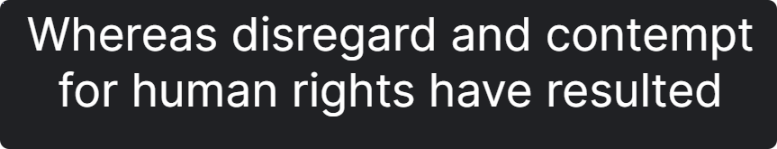


##### 4.3.1.4 Gochi-Hand ✅

- *Gochi Hand* is a typographic interpretation of the handwriting of a teenager.
  - The style is fresh, not like the letters made by a calligrapher, but those of an ordinary person.
  - The glyphs were carefully designed with a good curve quality, which makes it able to look good when printed too.
- *[Huerta Tipográfica](http://huertatipografica.com/)* is a collaborative Argentinian type foundry with a deep respect for design and typography.
- Chosen for:
  1. To resemble hand-drawn, or handwriting, drawing of the tokens in a game of Tic Tac Toe
  3. And it compliments *Inter* as simultaneous complementary pairing.
- Download: [Gochi-Hand - Google Fonts](https://fonts.google.com/specimen/Gochi+Hand "Designed by [Huerta Tipográfica]")


> <small>Note: These screenshots of fronts come from Google Fonts for Inter and Gochi-Hand respectively. The quotes are mundane in this project's context and have no political intention or design.</small>

#### 4.3.2 Coolors and Accessibility ✅
> Color Matching Service: [Coolors.com ](https://coolors.co/2e3444-6366f1-000000-e5e7eb-f1f6fe-6e2b63 "Coolors.com")

- Gunmental
- Neon Blue
- Black
- Anti-flash White
- Alice Blue
- Byzantium

#### 4.3.2.1 Palette Variations: Shades ✅

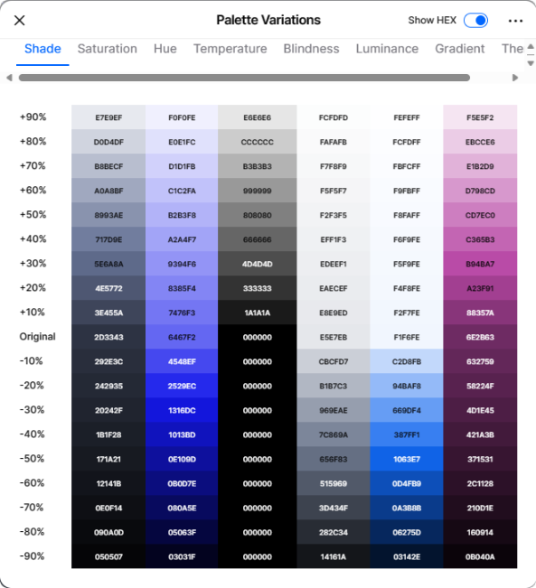

#### 4.3.2.2 Palette Contrast ✅

- Colors have to match or exceed a rating of 4.5:1

| **All Palate Pairs**                                         | **Accessible Pairs**                                         |
|-------------------------------------------------------------|--------------------------------------------------------------|
| 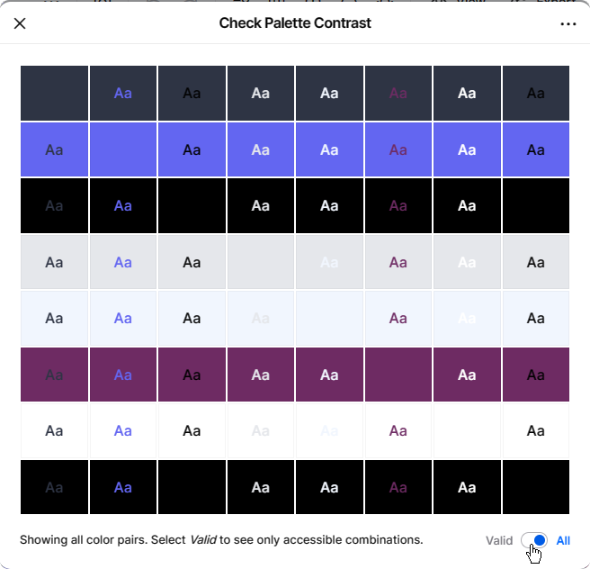| 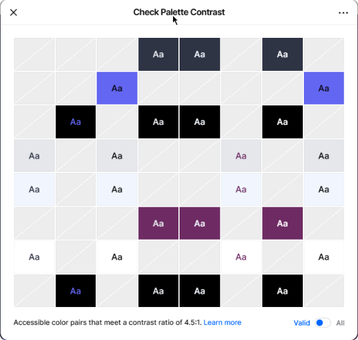 |

#### 4.3.2.3 Chosen Colors ✅


---

> ::

---

## 5.0 Build ✅

> <small><sup> Complete: ✅ 24/01/23</sup></small>

### 5.1 IDE & Environments ✅

- [X]  `Windows 22H2`: `version 11.0.22621.2715` - [Windows](https://www.microsoft.com/en-gb/windows)
- [X]  `Git`: `version 2.42` - [Git](https://git-scm.com/)
- [X]  `Nodist/Node`: `version 20.10.0` - [Node](https://nodejs.org/en/)
- [X]  `Nodeist/NPM`: `version 9.8.1`  - [NPM](https://www.npmjs.com/)
- [X]  `JetBrains | WebStorm`: `version  2023.2.3`  - [JetBrains WebStorms](https://www.jetbrains.com/webstorm)

#### 5.1.1 IDE Plugins

- [X]  `SonarLint` - [SonarLint](https://plugins.jetbrains.com/plugin/7973-sonarlint/)
- [X]  `Browserlist` - [Browserlist](https://plugins.jetbrains.com/plugin/9275-browserlist/)
- [X]  `Tailwind CSS` - [Tailwind CSS](https://plugins.jetbrains.com/plugin/12075-tailwind-css/)
- [X]  `W3C Validation` - [W3C Validation](https://plugins.jetbrains.com/plugin/7322-w3c-validation/)

---

### 5.2 AI Agents & Services ✅

> AUTHORS NOTE: AI Assistance is here to stay, as a developer *tool*. The author it is as random as a fellow human in the quality of the output based on it level of skill/domain it knows; as well as the quality of the prompt/input by the author-developer. It can be super helpful if the knowledge is a known problem domain. It can super mis-leading is the domain is an unknown or unfamiliar issue/concept. Any code here submitted is by the developers own submission, and with probably assisted by the AI Agent, and well tested to be working by the author's own experience and hard effort/man-hours.

- [X]  `Perplexity AI`: _[`version 1.0.0`](https://www.perplexity.ai/)_ - [Perplexity AI](https://www.perplexity.ai/)
  - AI Research and Sources: Context AI Assisted Search and Secondary Searches, with source citations and links.
  - Perplexity AI Search - Chrome | Edge Extension; default search engine
  - Perplexity AI Companion - Chrome | Edge Extension; chat while browsing
- [X]  `JetBrains AI Assistant`: _[`version 233.11799.196`](https://plugins.jetbrains.com/plugin/22282-ai-assistant/versions/stable)_ - [AI Assistant](https://plugins.jetbrains.com/plugin/22282-ai-assistant):
  - **Features**: Code Generation, Code Completion, Code Analysis, Code Navigation, Code Refactoring, Code Inspection, Code Highlighting, Code Formatting, Code Folding, Code Templates, Code Style, Code Intentions, Code Actions, Code Linting, Code Documentation, Code Comments, Code Snippets.

---

### 5.3 Libraries & Frameworks ✅

#### 5.3.1 npm Tooling

> See [`package.json`](https://github.com/iPoetDev/P2-Template/blob/main/package.json) for full list of dependencies

##### Dependencies

- [X]  `tailwindcss`:
  _[`version 3.3.3`](https://www.npmjs.com/package/tailwindcss)_ - [tailwindcss](https://www.npmjs.com/package/tailwindcss)
  - [X]  `autoprefixer`: _[`version 10.4.16`](https://www.npmjs.com/package/autoprefixer)_ - [autoprefixer](https://www.npmjs.com/package/autoprefixer)
  - [X]  `postcss`: _[`version 8.4.31`](https://www.npmjs.com/package/postcss)_ - [postcss](https://www.npmjs.com/package/postcss)

##### devDependencies

> See package.json for updated versions. These stated version are only indicative, as `NPM install` has been run regularly from first draft.

- [X]  `editorconfig`: _[`version 2.0.0`](https://www.npmjs.com/package/editorconfig)_ - [editorconfig](https://www.npmjs.com/package/editorconfig)
- [X]  `eslint`: _[`version 8.51.0`](https://www.npmjs.com/package/eslint)_ - [eslint](https://www.npmjs.com/package/eslint)
  - [X]  `eslint-config-defaults`:
    _[`version 9.0.0`](https://www.npmjs.com/package/eslint-config-defaults)_ - [eslint-config-defaults](https://www.npmjs.com/package/eslint-config-defaults)
  - [X]  `eslint-config-prettier]`:
    _[`version 9.0.0`](https://www.npmjs.com/package/eslint-config-prettier)_ - [eslint-config-prettier](https://www.npmjs.com/package/eslint-config-prettier)
  - [X]  `eslint-config-semistandard`:
    _[`version 17.0.0`](https://www.npmjs.com/package/eslint-config-semistandard)_ - [eslint-config-semistandard](https://www.npmjs.com/package/eslint-config-semistandard)
  - [X]  `eslint-config-standard`:
    _[`version 17.1.0`](https://www.npmjs.com/package/eslint-config-standard)_ - [eslint-config-standard](https://www.npmjs.com/package/eslint-config-standard)
  - [X]  `eslint-import-resolver-node`:
    _[`version 0.3.9`](https://www.npmjs.com/package/eslint-import-resolver-node)_ - [eslint-import-resolver-node](https://www.npmjs.com/package/eslint-import-resolver-node)
  - [X]  `eslint-module-utils`:
    _[`version 2.8.0`](https://www.npmjs.com/package/eslint-config-defaults)_ - [eslint-config-defaults](https://www.npmjs.com/package/eslint-config-defaults)
  - [X]  `eslint-plugin-import`:
    _[`version 2.28.1`](https://www.npmjs.com/package/eslint-plugin-import)_ - [eslint-plugin-import](https://www.npmjs.com/package/eslint-plugin-import)
  - [X]  `eslint-plugin-security`:
    _[`version 1.7.1`](https://www.npmjs.com/package/eslint-plugin-security)_ - [eslint-plugin-security](https://www.npmjs.com/package/eslint-plugin-security)
  - [X]  `eslint-eslint-scope`:
    _[`version 7.2.2`](https://www.npmjs.com/package/eslint-scope)_ - [eslint-scope](https://www.npmjs.com/package/eslint-scope)
  - [X]  `eslint-utils`:
    _[`version 3.0.0`](https://www.npmjs.com/package/eslint-utils)_ - [eslint-utils](https://www.npmjs.com/package/eslint-utils)
- [X]  `htmlhint`: _[`version 1.1.4`](https://www.npmjs.com/package/htmlhint)_ - [htmlhint](https://www.npmjs.com/package/htmlhint)
- [X]  `live-server`: _[`version 1.2.1`](https://www.npmjs.com/package/live-server)_ - [live-server](https://www.npmjs.com/package/live-server)
- [X]  `local-web-server`: _[`version 1.0.0`](https://www.npmjs.com/package/local-web-server)_ - [local-web-server](https://www.npmjs.com/package/local-web-server)
- [X]  `prettier`: _[`version 3.0.3`](https://www.npmjs.com/package/prettier)_ - [prettier](https://www.npmjs.com/package/prettier)
  - [X]  `prettier-plugin-django-alpine`: _[`version 1.2.6`](https://www.npmjs.com/package/prettier-plugin-django-alpine)_ - [prettier-plugin-django-alpine](https://www.npmjs.com/package/prettier-plugin-django-alpine)
  - [X]  `prettier-plugin-tailwind`: _[`version 0.5.6`](https://www.npmjs.com/package/prettier-plugin-tailwindcss)_ - [prettier-plugin-tailwindcss](https://www.npmjs.com/package/prettier-plugin-tailwindcss)
- [X]  `standard`: _[`version 17.1.0`](https://www.npmjs.com/package/standard)_ - [standard](https://www.npmjs.com/package/standard)
  - [X]  `snazzy`: _[`version 9.0.0`](https://www.npmjs.com/package/snazzy)_ - [snazzy](https://www.npmjs.com/package/snazzy)
- [X]  `stylelint`: _[`version 15.10.3`](https://www.npmjs.com/package/stylelint)_ - [stylelint](https://www.npmjs.com/package/stylelint)
  - [X]  `stylelint-config-standard`:
    _[`version 34.0.0`](https://www.npmjs.com/package/stylelint-config-standard)_ - [stylelint-config-standard](https://www.npmjs.com/package/stylelint-config-standard)
  - [X]  `stylelint-config-recommended`:
    _[`version 13.0.0`](https://www.npmjs.com/package/stylelint-config-recommended)_ - [stylelint-config-standard](https://www.npmjs.com/package/stylelint-config-recommended)
  - [X]  `stylelint-config-tailwindcss`:
    _[`version 0.0.7`](https://www.npmjs.com/package/stylelint-config-tailwindcss)_ - [stylelint-config-tailwindcss](https://www.npmjs.com/package/stylelint-config-tailwindcss)
  - [X]  `stylelint-csstree-validator`:
    _[`version 3.0.0`](https://www.npmjs.com/package/stylelint-csstree-validator)_ - [stylelint-csstree-validator](https://www.npmjs.com/package/stylelint-csstree-validator)

---

### 5.4 Repository & Hosting ✅

#### 5.4.1 Repository (Version Source Control) ✅

- [X]  `GitHub.com`: _[`Github Respoistory`](https://www.github.com)_
- [X]  `GitHub.io`: _[`Github Pages`](https://pages.github.com/)_

#### 5.4.2 Apps (Code Integration & Deployment) ✅

- [X]  `Dependabot Preview`: _[GitHub: Dependabot](https://dependabot.com/)_ - [Dependabot](https://dependabot.com/)
- [X]  `GitLive`: _[GitHub Marketplace: GitLive](https://github.com/marketplace/teamhub_ - [GitLive](https://gitlive.app/)
- [X]  `GitHub Actions`: _[GitHub Marketplace: IssueLabeler](https://github.com/marketplace/supershields)_ - [IssueLabeler by riyadhalnur](https://riyadhalnur.github.io/issuelabeler/) : [Probot](https://probot.github.io/)
- [X]  `Supershields`: _[GitHub Marketplace: Supershields.io](https://github.com/marketplace/supershields)_ - [Supershields.io](https://supershields.io)
- [X]  `Wakatime`: _[GitHub Marketplace: Wakatime](https://github.com/marketplace/wakatime)_ - [Wakatime](https://wakatime.com)

---

> ::

---

## 6.0 Code ✅

> <small><sup> Complete: ✅ 24/01/23</sup></small>

#### 6.0.1 Version Control ✅

##### 6.0.1.1 [Keep a Changelog](https://keepachangelog.com/en/1.0.0/) ✅

> A changelog is a file, which contains a curated, chronologically ordered list of notable changes for each version of a
> project.

- All notable changes to this project will be documented in this file.
- To make it easier for users and contributors to see precisely what notable changes have been made between each
  release (or version) of the project.
- People do. Whether consumers or developers, the end users of software are human beings who care about what's in the
  software. When the software changes, people want to know why and how.
- The format is based on [Keep a Changelog](https://keepachangelog.com/en/1.0.0/),
  and this project adheres to [Semantic Versioning](https://semver.org/spec/v2.0.0.html).

- [X]  `Keep a ChangeLog`: _[`version 1.0.0`](https://keepachangelog.com/en/1.0.0/)_ - [Keep a ChangeLog](https://keepachangelog.com/en/1.0.0/)

##### 6.0.1.2 [Conventional Commits](https://www.conventionalcommits.org/en/v1.0.0/) ✅

> The Conventional Commits specification is a lightweight convention on top of commit messages. It provides an easy set
> of rules for creating an explicit commit history; which makes it easier to write automated tools on top of. This
> convention dovetails with [SemVer](http://semver.org/), by describing the features, fixes, and breaking changes made in commit messages.

- [X]  `Conventional Commits`: _[`version 1.0.0`](https://www.conventionalcommits.org/en/v1.0.0/)_ - [Conventional Commits](https://www.conventionalcommits.org/en/v1.0.0/)

##### 6.0.1.3 [SemVer Versioning](https://semver.org/))

> “Semantic Versioning.” Under this scheme, version numbers and the way they change convey meaning about the underlying
> code and what has been modified from one version to the next.

- Given a version number MAJOR.MINOR.PATCH, increment the:
  - **MAJOR** version when you make incompatible API changes
  - **MINOR** version when you add functionality in a backward compatible manner
  - **PATCH** version when you make backward compatible bug fixes
    ✅

##### 6.0.1.4 Custom Descriptive Commits

- The author decided to merge and customize the two commit message standards to create a more descriptive commit message standard.
- There is a convention for not using commit messages as a changelog, but the author has decided to use the commit
  message as a keep a changelog, long with aspects of conventional commit messages and dovetailing with SemVer (as best manu effort as possible).
- See the following example for a custom descriptive commit message:
  - Why: The commit messages are used for assessment purposes in an academic context.
  - Thus, this makes it easier for assessors to see precisely what notable changes have been made between each
    release (or version) of the project.
  - There is a loose adherence to the conventional commit message standard and SemVer.

```
type (optional scope): <description>

<optional body>
Intent:
Issue:
Fixed:
Tag:
Sprint:    01: Ends 23-mm-dd

<keepachangelog>
Bump:
Previous:  23-mm-dd v00.00.01.003
Changelog: 23-mm-dd v00.00.01.004
- add:
- modified:
- removed:
- fixed:
- linted:
- edits:
- deploy:

<optional footer>
Refs:
-
```

✅

#### 6.0.2 Code Structure ✅

###### 6.0.2.1 Design Patterns: Code Organisation ✅

- <ins>**Separation of Concerns v Locality of Behaviour**</ins>
  1. **Separation of Concerns**: HTML, CSS and JavaScript are kept in separate, linked files is a traditional approach to code factoring and project structure organization.
     - Related code is groups together in a single file by (mime-)type.
     - Allows for code re-use and centralized maintenance.
  2. **Locality of Behaviour**: The Locality of Behaviour principle states that the behaviour of code should be obvious
     on inspection. Or more formally: The behaviour of a unit of code should be as obvious as possible by looking only
     at that unit of code.
     - .
     - .

#### 6.0.3 Code Style ✅

** 6.0.3.1 Style Guides**

- [X]  `HTML`: _[`HTML Style Guide`](https://www.w3schools.com/html/html5_syntax.asp)_ - [HTML Style Guide](https://www.w3schools.com/html/html5_syntax.asp)
- [X]  `CSS`: _[`CSS Style Guide`](https://www.w3schools.com/css/css_syntax.asp)_ - [CSS Style Guide](https://www.w3schools.com/css/css_syntax.asp)
- [X]  `JavaScript`: _[`JavaScript Style Guide`](https://www.w3schools.com/js/js_conventions.asp)_ - [JavaScript Style Guide](https://www.w3schools.com/js/js_conventions.asp)

** 6.0.3.2 Clean Code** ✅

- [X]  ✅ `Clean Code Characteristics`: Project requirements for code quality and standards.
  - [X]  ✅ Code demonstrates the characteristics of ‘clean code’
    - all code is split into well-defined and commented sections
  - [X]  ✅ File Naming Conventions
  - [X]  ✅ HTML attributes, CSS rules, code variables and function:
    - names are consistent in the format.
    - follow standards for the language and are appropriate and meaningful
    - id/class(CSS and JavaScript)/function/variable names clearly indicate their purpose
    - The semantic markup is used to structure HTML code
  - [X]  ✅ Class/Function/Variable Name Conventions: names are descriptive and consistent
  - [X]  ✅ Cross-Platform Compatibility: names will not have spaces in them and will be lower-case only.
  - [X]  ✅ Code is well-structured and easy to read.
- [X]  ✅ `Code Readability and Maintainability`:
  - [X]  ✅ Code is indented in a consistent manner to ease readability
  - [X]  ✅ Code has no unnecessary repeated blank lines (and never more than 2)
- [X]  ✅ `Code Formating`: The Clean Code Characteristic enforced by and (actions on save):
  - JetBrains IDE Code Style
  - Editorconfig: IDE / Per Language
  - Prettier: on each commit, via JB commit actions, and on save.
  - ESLint for JavaScript
  - Stylelint
- [X]  ✅ `Code Linting`: The Clean Code Characteristic enforced by:
  - JetBrains IDE Code Style &amp; Code Inspections
  - HTMLHint
  - Stylelint
  - StandardJS for JavaScript
  - ESLint for JavaScript

#### 6.0.4 Project Structure ✅

- [X]  ✅  `Project Templates`: GitHub allows for each repository to be used as templates for new projects.
  - `Directory Structure` is defined in the repository template.
  - `Issue & Pull Request Templates` are defined in the repository template in the `.github` directory.
  - `File Structure` is defined in the repository template.
    - `Grouping by File Types`: e.g. assets directory will group related file types via subdirectories.
    - `Grouping by Libraries & Frameworks`: e.g. `node_modules` directory will group related file types via subdirectories. Though `node_modules` are not always pushed the remote repository.
    - `Grouping by Features`: e.g. `components` directory will group related file types via subdirectories.

#### 6.0.5 Planned Repository Structure ✅

```
📁: Project
 ├── 📁 .github
 |     ├── 📁 ISSUE_TEMPLATE
 |     ├── 📁 PULL_REQUEST
 |     ├── 📄 dependabot.yml
 ├── 📁 .run
 ├── 📁 node_modules
 ├── 📁 refs
 |     ├── 📁 assets
 |     |    ├── 📁 images
 |     ├── 📁 decisions
 |     ├── 📁 design
 |     ├── 📁 features
 |     ├── 📁 acceptance
 |     ├── 📁 deployment
 ├── 📁 src
 |    ├── 📁 assets
 |    |    ├── 📁 css
 |    |    ├── 📁 fonts
 |    |    ├── 📁 img
 |    |    |__ 📁 js
 |   ====================
 ├── 📄 index.html
 |   ====================
 ├── 📄 README.md
 ├── 📄 AUTHORS
 ├── 📄 CITATION
 ├── 📄 CODEOWNERS
 ├── 📄 CODE_OF_CONDUCT.md
 ├── 📄 LICENSE
 |   ====================
 ├── 📄 .gitattributes
 ├── 📄 .gitignore
 |   ====================
 ├── 📄 .editorconfig
 ├── 📄 .eslintrc.json
 ├── 📄 .htmlhintrc
 ├── 📄 .live-server.json
 ├── 📄 .jshintrc
 ├── 📄 .prettierrc.yaml
 ├── 📄 .prettierignore
 ├── 📄 .pre-commit-config.yaml
 ├── 📄 .stylelintrc.json
 ├── 📄 .tailwinorder
 ├── 📄 gitleaks.toml
 ├── 📄 postcss.config.js
 ├── 📄 tailwind.config.js
 |   ====================
 ├── 📄 package.json
 ├── 📄 package-lock.json
 ├── 📄 piecesdb.json
```

> **KEY**: 📁: _Folder_ , 📄: _File_ , ├── _Link_: Subdirectory, Linked File, | - _Link Generic_

---

---

### 6.1 HTML ✅

- `HTML5`: `v5.0`

#### 6.1.1 Linting / Static Code Analysis: `htmlHint` ✅

- The static code analysis tool you need for your HTML.
- Rules: https://htmlhint.com/docs/user-guide/list-rules

#### 6.1.2 HTML W3C Validation ✅

- This validator checks the [markup validity](https://validator.w3.org/docs/help.html#validation_basics) of Web documents in HTML.
- Use Validator: https://validator.w3.org/nu/#textarea
- Uses NPM: https://www.npmjs.com/package/w3c-html-validator

---

### 6.2 CSS ✅

#### 6.2.1 CSS Libraries & Frameworks ✅

- Modern CSS: CSSv3 with latest Browser Supports.
  - CanIUse: [Can I use... Support tables for HTML5, CSS3, etc](https://caniuse.com/)
    - provides up-to-date browser support tables for support of front-end web technologies on desktop and mobile web browsers.
    - Features: [Can I use... Features Index](https://caniuse.com/ciu/index)
    - CanIUse.com for CSS: [Can I use... Support tables for CSS3, etc](https://caniuse.com/?cats=CSS&statuses=all)
  - InterOp 2023: [web-platform-tests dashboard (wpt.fyi)](https://wpt.fyi/interop-2023)

#### 6.2.2 Linting: `StyleLint` ✅

- `StyleLint` `v15.11.0`:
  - A mighty CSS linter that helps you avoid errors and enforce conventions.
  - A linter and validator for CSS that is:
    - complete - coverage of all standard CSS syntax.
    - extensible - multiple points of extension.
    - configurable - options to tailor the linter.
    - robust - comprehensive test coverage.
    - consistent - conventions for behaviour, naming and documentation.
    - performant - tools to test and improve performance
  - Provide multiple points of extensions, including:
    - [custom syntax's](https://stylelint.io/developer-guide/syntaxes) - use any PostCSS-compatible syntax to support other CSS-like languages and containers
    - [extendable configs](https://stylelint.io/user-guide/configure#extends) - extend and share configurations
    - [formatters](https://stylelint.io/developer-guide/formatters) - format Stylelint result objects
    - [plugins](https://stylelint.io/developer-guide/plugins) - build custom rules to support methodologies, toolsets, non-standard CSS features,
  - *Web*: [Home | Stylelint](https://stylelint.io/)
  - *GitHub*: [stylelint/stylelint: A mighty CSS linter that helps you avoid errors and enforce conventions. (GitHub.com)](https://github.com/stylelint/stylelint)
  - *NPM*: [stylelint - npm (npmjs.com)](https://www.npmjs.com/package/stylelint)

#### 6.2.3 CSS W3C Validation ✅

- W3C CSS* compatibility for *W3C JigSaw*: [Cascading Style Sheets (w3.org)](https://www.w3.org/Style/CSS/)
  - [So, this is the authority on what is correct CSS and what isn't? (w3.org)](https://jigsaw.w3.org/css-validator/about.html#reference):
    - **No**. It is a helpful and reliable tool, but a software tool.
    - The actual reference on Cascading Style Sheets are the [CSS Specifications](http://www.w3.org/Style/CSS/#specs).
  - This tool is largely out of date, and documentation on their [About the W3C CSS Validation Service](https://jigsaw.w3.org/css-validator/about.html) has references to 2.1.
    - Useful for learning purposes, however there are features in *ModernCSS* (*InterOp 2023*, between browser vendors) that are seen as errors in *W3C JigSaw*.

---

### 6.3 JavaScript ✅

#### 6.3.1 JS Libraries & Frameworks ✅

- `JavaScript` `vEC6`: *ECMAScrip 2015* - *ECMAScript 2020*.
  - MDN: [JavaScript | MDN (mozilla.org)](https://developer.mozilla.org/en-US/docs/Web/javascript)
  - W3CSchools: [JavaScript Versions (w3schools.com)](https://www.w3schools.com/Js/js_versions.asp)

#### 6.3.2 JS Linting ✅

> Read More: [4 options to help you get started linting your JavaScript - LogRocket Blog](https://blog.logrocket.com/four-options-to-help-you-get-started-linting-your-javascript-b4b829828648/)

- `esLint`: `v8.55.0`
- `standardJS`: `v`
- `JsHint`: `v2.13.6`

##### JSHint Ignore Pragma

The use of ``// jshint ignore:line`` indicates a code hotspot for code quality by JSHint standards, but elected to ignore. Below is a record summary of these code hotspots.

- ✅ File: `logic.js` (Fixing or Ignore 122 issues, JSHint by NPM)
  - E054: JSHint: Class properties must be methods. Expected '(' but instead saw '='. (E054)
  - W016: JSHint: Unexpected use of '++'. (W016) → > used play+= 1, line 1406
  - W030: JSHint: Expected an assignment or function call and instead saw an expression. (W030)
  - W071: JSHint: This function has too many statements. (23) (W071), Line 71,606, 703, 980, 1063, 1110,1260,1311, 1387, 1489, 1582
  - W072: JSHint: This function has too many parameters. (8) (W072)
  - W098: Line 94-95 JSHint: 'caller' is defined but never used. (W098)
  - W101: JSHint: Line is too long. (W101): Remedied by code to next line.
  - W117: JSHint: 'console' is not defined. (W117): Line 122, 133, 145, 157, 169, 180
- ✅ File: ``logging.js``: 2024/01/22
- ✅ File: `watch.js`: 2024/01/22
- ✅ File: `ui1.js`: 2024/01/22
- ✅ File: `onloadinit.js`: 2024/01/22

##### JetBrains NoInspections

The use of ``// noinspections`` indicates a code hotspot for code quality by JetBrain Webstorm IDE code styles, but elected to ignore.

---

> ::

---

## 7.0 Logic & Code Flow ✅

> <small><sup> Complete: ✅ 24/01/23</sup></small>

#### 7.1 Mermaid: Code Flow: ``Logic.JS: GameLogic Class``

> What follows is a series of Mermaid Flowchart of the game logic class tracking the method calls, and key returns objects.
> The class GameLogic acts as like a server / backend to the Game of Tic Tac Toe.

**Question: Why This Design**

> 1. Could a simpler design be used, most definitely.
> 2. Dies ot my 20 year old bias for OOP and class based design, I fall into a cognitive/design bias for OOP and Classes based on my prior knowledge of Java, C# and other back end technologies.
> 3. However, after man-hours of effort, I was committed to this design.
> 4. In future versions, would I choose this approach. No
> 5. Does it showcase my skills and coding techniques, Yes.
> 6. I get to play with Mermaid as a text to diagram documentation skill.

##### Select Cell, Click & Move Validity

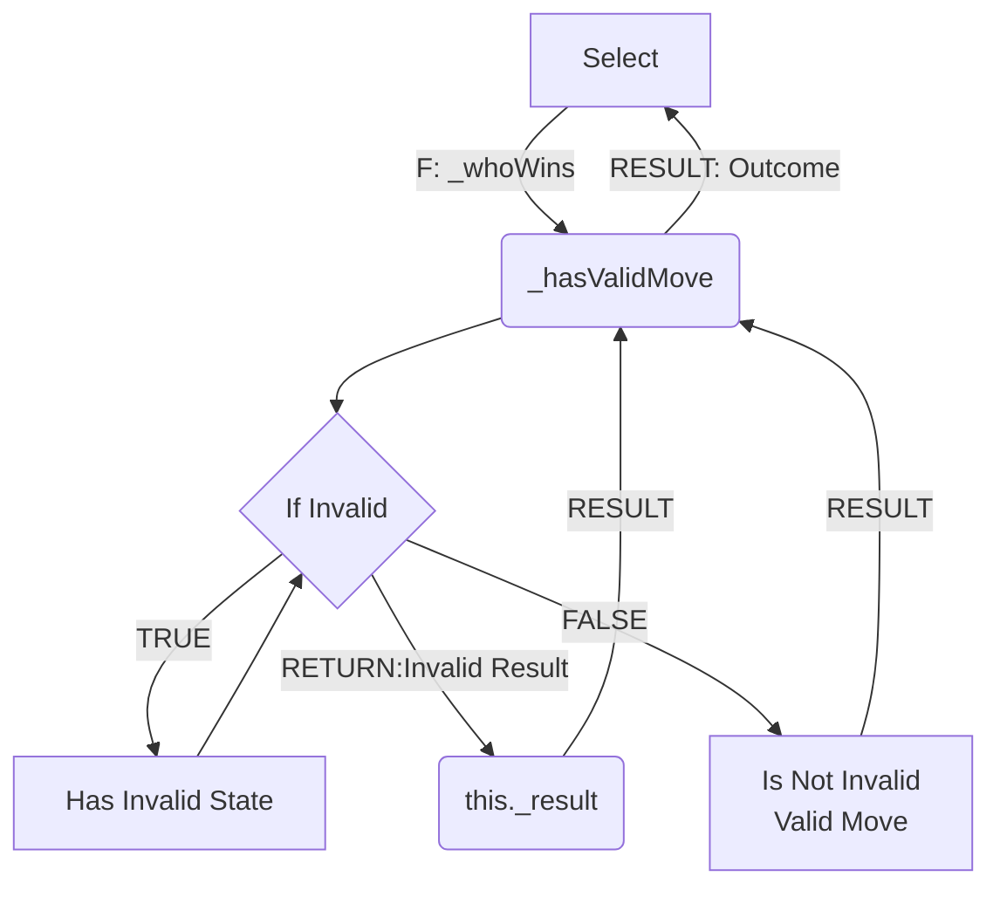

##### Valid Moves: Who Wins & Make Turns

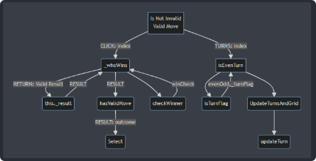

##### Make Turns: Turn Flags, Update Turns Data & Increment Turns/Swap Players

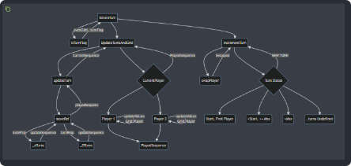

##### Check For Win: Outcome, Sequence Match, Declare Winner

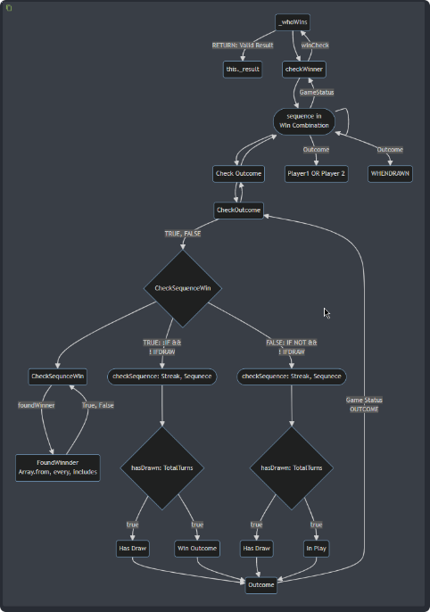

##### Check Game State Outcomes, with Winning Sequence

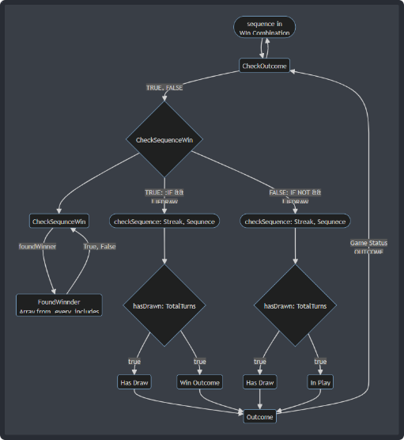

## 8.0 Test & Quality ✅

> <small><sup> Complete: ✅ 24/01/23</sup></small>

### 8.1 Code Quality & Validation ✅

#### 8.1.1 HTML ✅

> Version: 23.11.28

- Last Inspection: 2024/01/22
- Count: 6


| Page     | URI Slug               | Validation Type | Issue                                                               | Resolved                                                                 |
| -------- | ---------------------- | --------------- | ------------------------------------------------------------------- | ------------------------------------------------------------------------ |
| Page     | `index.html`           | `Info`          | Info: Trailing slash on void elements                               | Yes, removed, 24-01-22                                                   |
| External | `index.html`, line 120 | `Warning`       | Warning: The type attribute is unnecessary for JavaScript resources | Kept, Ignored, as current Browsers DevTools showed warnings on Mime Type |
| External | `index.html`, line 121 | `Warning`       | Warning: The type attribute is unnecessary for JavaScript resources | Kept, Ignored, as current Browsers DevTools showed warnings on Mime Type |
| External | `index.html`, line 122 | `Warning`       | Warning: The type attribute is unnecessary for JavaScript resources | Kept, Ignored, as current Browsers DevTools showed warnings on Mime Type |
| External | `index.html`, line 123 | `Warning`       | Warning: The type attribute is unnecessary for JavaScript resources | Kept, Ignored, as current Browsers DevTools showed warnings on Mime Type |
| External | `index.html`, line 124 | `Warning`       | Warning: The type attribute is unnecessary for JavaScript resources | Kept, Ignored, as current Browsers DevTools showed warnings on Mime Type |

#### 8.1.2 CSS ✅

> AUTHOR NOTE: TailwindCSS auto generates CSS via JS and may output non-compliant CSS, or modern variants of CSS that the CSS Jigsaw engine may not be up-to-date. So any errors listed here are only a guide, and errors from Tailwinds generated CSS are out of scope. If the CSS displays; and the feature is styled, so be it.
>
> Listed CSS issues here are author-generated as the author has little control over output CSS from TailwindCSS.

- URI: https://jigsaw.w3.org/css-validator/validator?uri=https%3A%2F%2Fipoetdev.github.io%2FMiniTicTacToe%2F&profile=css3svg&usermedium=all&warning=1&vextwarning=&lang=en @ 24/01/22 @ 16:01

##### 8.1.2. Tailwind Styles ✅

> Source: https://ipoetdev.github.io/MiniTicTacToe/src/assets/css/tw-style.css
> Auto Generated

##### ERRORS (60) ✅

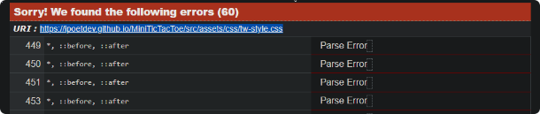
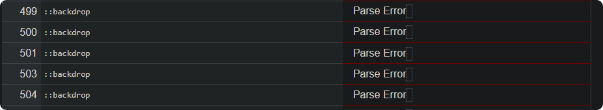
**`60 Errors: CSS Jigsaw Parse/System Error`**

- Unable to parse, reasons unknown, out of scope to fix via TailwindsCSS.
  - `*, ::before, ::after`
  - `::backdrop`

##### WARNING (23) ✅

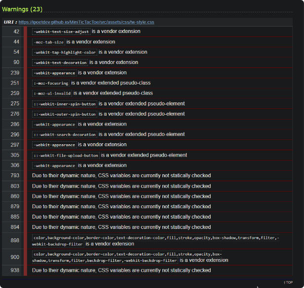

- Resolution: Out of scope as these are auto generated by Tailwinds.

---

### 8.2 Bugs & Issues ⛔

> This project used [GitHub Issues](https://github.com/iPoetDev/MiniTicTacToe/issues) to track, triage and describe project and code level bugs.

- **ISSUE #15 <ins>BUG :: DRAW STATE is indeterminate: GameLogic._checkOutcome Conditionals</ins>** #15: https://github.com/iPoetDev/MiniTicTacToe/issues/15,
  - Status: Can't Fix before the deadline.
- **ISSUE**: invalid/bad move
- **ISSUE**: One click beyond win/outcome state: reference error in console logs.
---

> ::

---

## 9.0 Features & User Acceptance ✅

> Complete: ❓ | Review: 📝 | To Do: 📌

> - Is a mirror of section 3.3 Milestones in User Experience: But with the User Acceptance Completed
> - User Acceptance using then `Given...When...Then` of Behavioral Drive Testing and Agile Planning.

### 9.1 Features & User Acceptance ✅

### 9.1.1 **Game Brand**: Purpose and Context

```text
✅ Feature: App Branding & Brand Identity:
  - ⛔ Icon: None, Future Version
  - Title/Text: Mini Tic Tac Toe, in a cursive hand written script
  - Color: See 4.3.2 for colors, theme is dark blue grey/gunmetal/indigo
  - Whitespacing: Minimalist in style: few component
  - Dark Mode: Yes
✅ Is Part Of: Web Page
Version: 2.0.1.11
✅ Benefit:
  - Implies and imparts the game's intent and context implicitly.
  - A good Brand Identity allows for an emotional and logical connection as to the design ethos of the App.
  - A strong brand allows for quick recognition of the game's purpose and intuitive informational clues to how the game is played.
```
##### 9.1.1.1 Acceptance: ✅
- **Given** That the web page has a banner; and a byline
- **When** I load a web app page
- **Then** I accept that the page looks as anticipated for branding and identifying page purpose
    - **AND**: See that the font and dark look give a focus on to the game area, which is a lighter tone.
    - **BUT**: Does not include an icon or favicon to help with brand identity

---

### 9.1.2 **Game Banner**: ✅

```text
✅ Feature: The Game Banner is the page container that is composed of :
  - Game Title
  - ByLine:
    - Link to User Profile
    - Link to Project Repository on GitHub.com
✅ Is Part of: Web Page
Version: 2.0.1.11
✅ Benefit:
  - Allows for brand identity (a Title/Heading/Icon) positioning.
  - Allows for positioning simple in-game controls (like toggles) to control game options.
```

##### 9.1.2.1 Acceptance: ✅
- **Given** That the web page has a banner; and a byline
- **When** I Look at the vertical alignment of the banner to the game area.
- **Then** I accept that the page looks as anticipated for branding and identifying game controls.
    - **AND**: See links to GitHub to look beyond the website and into the project repository.
    - **AND**: Simple set of in game controls: two visible buttons: reset and help.

---

### 9.1.3 **Game Title** ✅

```text
✅ Feature: The Game Title is the page element that is composed of :
  - Logo Heading: Mini Tic Tac Toe
✅ Is Part of: Game Brand
Version: 2.0.1.11
✅ Benefit:
  - Allows for brand identity (a Title/Heading) positioning.
  - Applying brand style and theming. See colors and fonts in section 4.0
```

##### 9.1.3.1 Acceptance: ✅
- **Given** That the web page has a banner and its content.
- **When** I Look at the Bold Title and By Line,
  - **AND** I look at Title of Mini, gives a clue to the look and feel of the game: minimalist.
- **Then** I accept that the page looks as anticipated for branding and identifying game controls.
    - **AND**: See links to GitHub to look beyond the website and into the project repository.
    - **AND**: The dark mode of the look and feel
    - **AND**: Along with the cursive handwritten style gives a fun relax air.

---

### 9.1.4  **Game Controls** ✅

```text
✅ Feature:
  - Grid Cell Button x9: Receives the users click, to start the game and make each turn, as display the outcome of each turn
  - Reset Button: Rest the GameLogic engine AND the Game UI
  - Help Button: To Open the Game FAQ Modal/Pop Up
  - Close Buttons x2: To Close the Game FAQ Modal/Pop Up
✅ Version:
✅ Benefit:
  - Essential initiators of user interaction.
  - Additional surface for UI visuals and interactivity when user points a cursor
  - Display outcome of the user selection.
  - Show/hide hidden context/surfaces for additional contextual information
```
##### 9.1.4.1 Acceptance: ✅
- **Given** the explicit and Implicit Controls, I can operate the game.
- **When** I start to click on the UI anywhere in the grid or on a button.
- **Then** I can see response to my interaction selections.
    - **AND** I get animated tokens
    - **AND** I get clues to which grid cell I am hovering over as it is highlighted
    - **AND** I get immediate and smooth responses to interaction on each click
    - **AND** I get the tokens to highlight themselves when I hover, focus on active selections.

---

### 9.1.5 **Game Board** ✅

```text
✅ Feature:
  - 3 Rows of 3 grid Cells,each with an id of cell-id-{i} where i: 0>= i <=8
  - Each Cell is made up of Button for user interaction, event handling and action outcome, as well as animation effects.
✅ Version:
✅ Benefit:
  - Use of buttons, which are natural event handlers for interactions, simplifies good design and implementation for each user selection
```

##### 9.1.5.1 Acceptance: ✅
- **Given** the explicit and Implicit Controls, I can operate the game.
- **When** I start to click on the UI anywhere in the grid or on a button.
- **Then** I can see response to my interaction selections.
    - **AND** I get animated tokens
    - **AND** I get clues to which grid cell I am hovering over as it is highlighted
    - **AND** I get immediate and smooth responses to interaction on each click
    - **AND** I get the tokens to highlight themselves when I hover, focus on active selections.

---

### 9.1.6 **Game Messages** ✅

```text
✅ Feature:
  A) Feedback on the game outcome
  - Update the Outcome button at top of Game Area
  - Default ot `No Result`
  - Possible Outcome messages:
    1. Winner of X Round is X i.e. X is the number of rounds
    2. Winner of X Round is O
    3. ⛔ The game is a Draw (not yet finalised).
  B) Visuals from the interaction
    - Tokens bounce in animation
    - The selected grid panels on selection, in focus, when active, also animate per grid cell
✅ Version:
✅ Benefit:
   - Provides signals to the user that they:
     1) Have made their turn
     2) Have reached the end of the game
     3) ⛔ To have made an illegal/bad move (Not yet implemented)
```
##### 9.1.1.1 Acceptance: ✅
- **Given** I have made a series of moves against a player,
    - **AND** I have made a winning move, or made a drawing move,
    - **AND** I can see the visual result of the end of the game.
- **When** I expect to have made all possible valid moves
    - **AND** I have ended the game
- **Then** I should have a message stating that I have either Won | Drawn | Lost
    - **AND** The NO Result Button/Sign Updates with a Possible Outcome Message
    - **NOT** The NO DRAW message is NOT currently displaying as a Possible Outcome Message.

---

### 9.1.6 **Game FAQ: `? Help`** ✅

```text
✅ Feature: A Pop out help panel that
  - Informs of History fo the game with links to Wikipedia.
  - How the game is played convention.
  - How the current version of the game is to be played.
  - The current limitations, bugs, issues withe the game.
  - The future improvements scheduled on the roadmap.
✅ Version:
✅ Benefit:
  - Provides contextual and game instruction awareness to target audiences
  - Inform openly and transparent the bugs and limitations to the assessor/code reviewer for assessment/evaluation purposes.
```

##### 9.1.6.1 Acceptance: ✅
- **Given** I want to find more on the game of
    - **OR** I want to learn about how the game is played, and how the current game is played.
    - **OR** I want to learn about project was implemented, what issues it has, and what improvements are planned.
- **When** I click on the help button at the top of the page.
    - **AND** I see a pop-up window with dark semi translucent aspect, and white text.
    - **AND** I can just see the game behind the window
- **Then** I should be able to read the Game FAQ: Help on the History, Game Play, Limitations and Roadmap of the Game
    - **BUT** then I click on close buttons, top or button,
    - **AND** to close the pop-up window to exit.

---
>
---

### 9.2 Screenshots & Responsive Design ✅

#### 9.2.1 iPhone

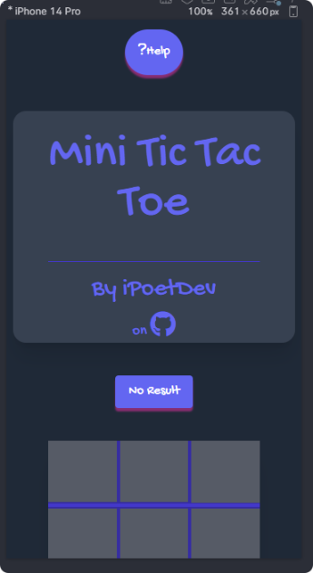

#### 9.2.2 iPad Pro 9.7 Portrait

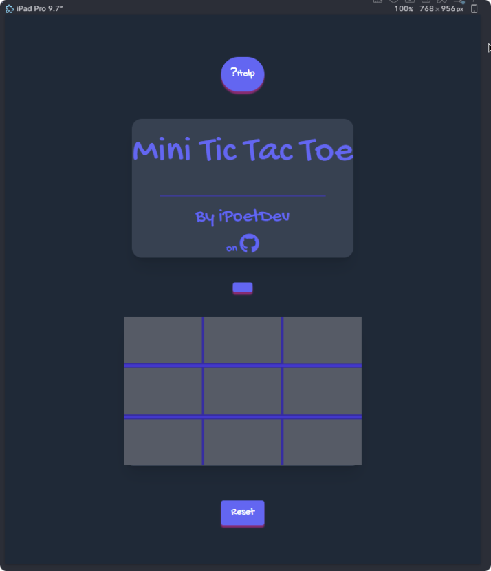

#### 9.2.3 iPad Pro 9.7 Landscape

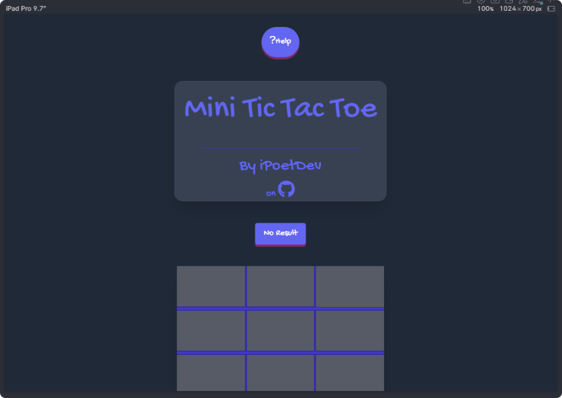

#### 9.2.4 Desktop Wide


#### 9.2.5 Desktop HD 1440px Wide

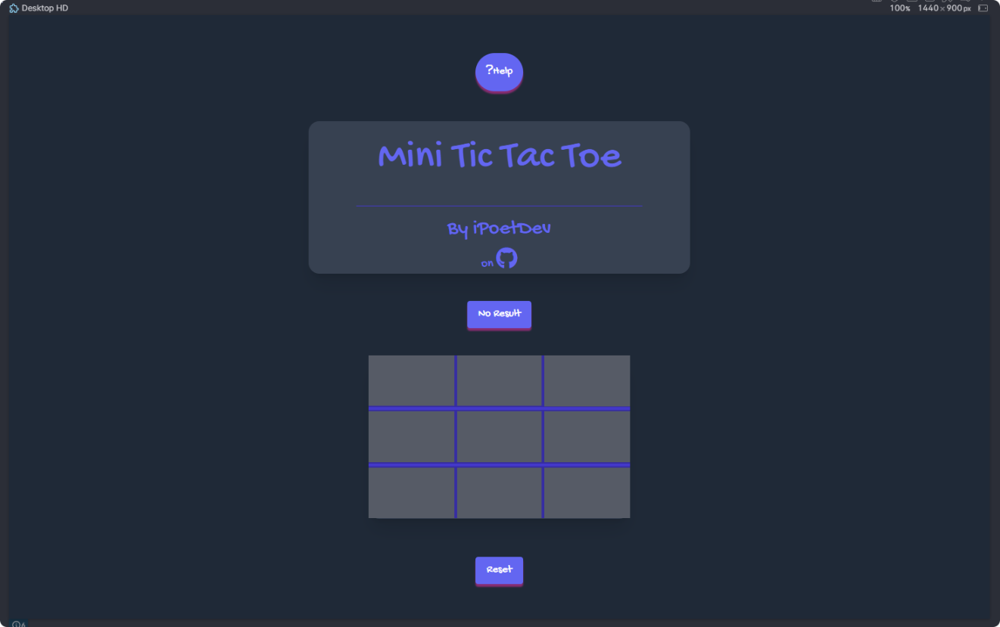

---

> ::

---

## 10.0 Deployment ✅✅

> <small><sup> Complete: ✅ 24/01/22</sup></small>

### 10.1 Deployment Strategy ✅

- Develop on `*/branch-name-vN.M` trunk (1️⃣)
- Pull Request and Merge into the `main` branch (2️⃣)
- Pull Request from `main` into the `deploy/mini_tictactoe` branch (3️⃣)

Notes on the above:

- 1️⃣: Strategy is to develop on long-lived development trunks on a per technology/design approach. Naming goes as follows:
  - a: Folder: Intent (i.e. before the `/`)
  - b: Branch Name: Identifier / Module Name (i.e. after the `/`)
- 2️⃣: PR into `MAIN` branch act as a final code review/quality gate (if configured for SonarLint CI and other code review/code quality tools). This is keep light weight for now.
- 3️⃣: Working and Code Review Code is then deployed into long-lived (maybe in future, per each major version) branches to which GitHub.io Pages environments are configured. This is keep light weight for now.

```
Regular pushes to trunk branches, and then pull into to main and finally to deploy/* branches.
```

### 10.2 Deployment Configuration ✅

- Source: Deploy from Branch: `deploy/mini_tictactoe`
- Root: `./` or root 📂
- SRC:  `./src/assets/*` or src 📂 for *css/js/fonts/img*

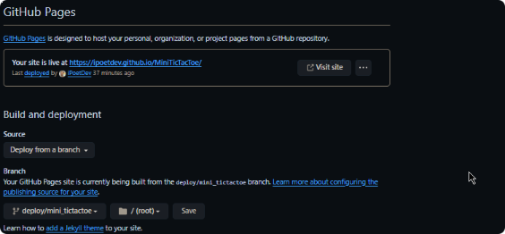

### 10.3 Deployment Environments ✅

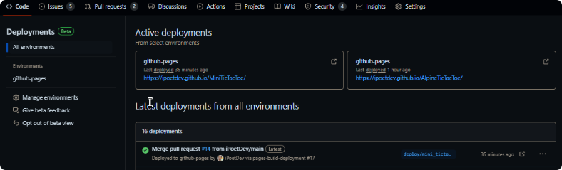
**`Example Deployment from GitHub.com for GitHub.io in GitHub Environments`** *Dated: 2024/01/22*

### 10.4 GitHub Pages: Live Site ✅

- URL: https://ipoetdev.github.io/MiniTicTacToe/
- Site:

```http
https://ipoetdev.github.io/MiniTicTacToe/
```

---

> ::

---

## 11.0 Assessments

> <small><sup> Complete: ✅ 24/01/22</sup></small>

**AUTHORS NOTE**: As this submission is a resit and second attempt, there is not much accreditation to be made here.

### 11.1 Credits

### 11.2 External Sources

- Mozilla Web Docs: https://developer.mozilla.org/
  - Proxy Objects
  - Console Logging

#### 11.2.A: AI
> Fir each of the following services, I have a record od stored prompts and responses for inspection if so called upon.

- Perplexity.AI: https://www.perplexity.ai/
- JetBrains Assistance: Pro Subscriber, 1 Year as a User fo JetBrains. https://www.jetbrains.com/ai/
    - This makes natural sense, and I hardly turn to other sources.

#### 11.2.2: Prior Submissions

- Myself: 1st Attempt at Tic Tac Toe: https://github.com/iPoetDev/terni-lapilli--toe
  - Prior to Art and Prior knowledge was developed in March and April 2023

---

> ::

---
