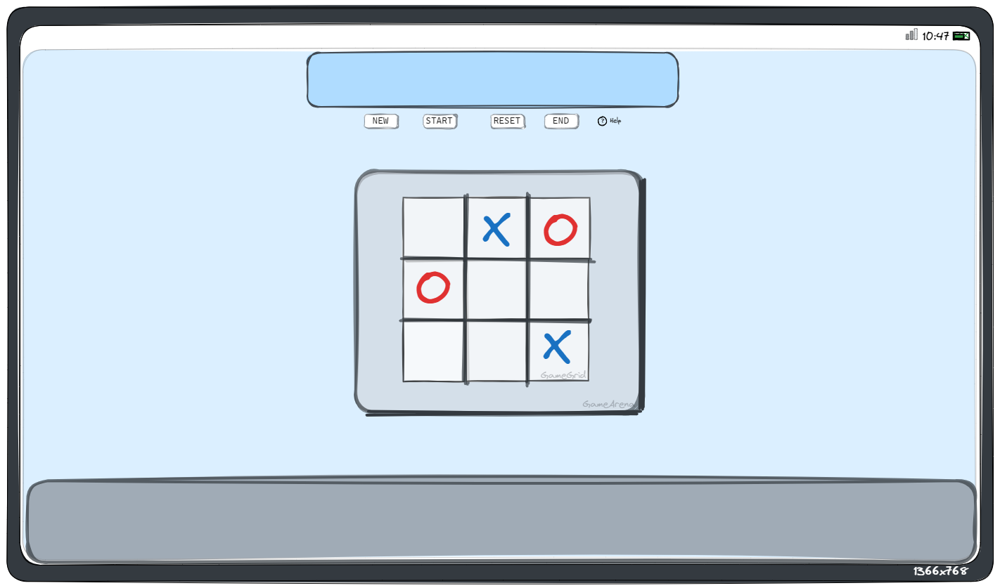
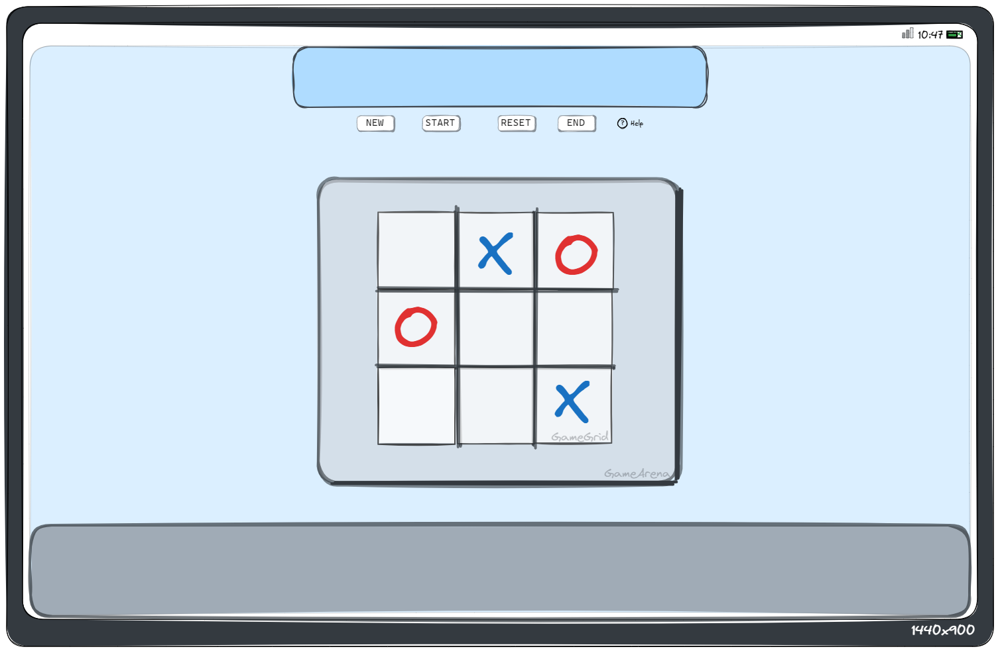
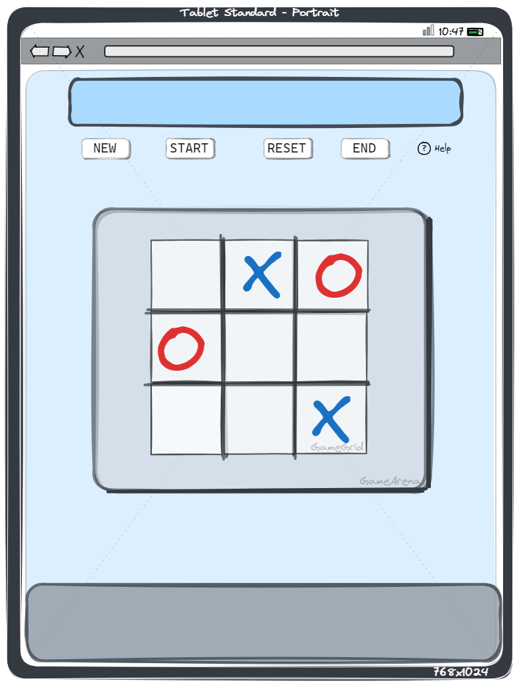
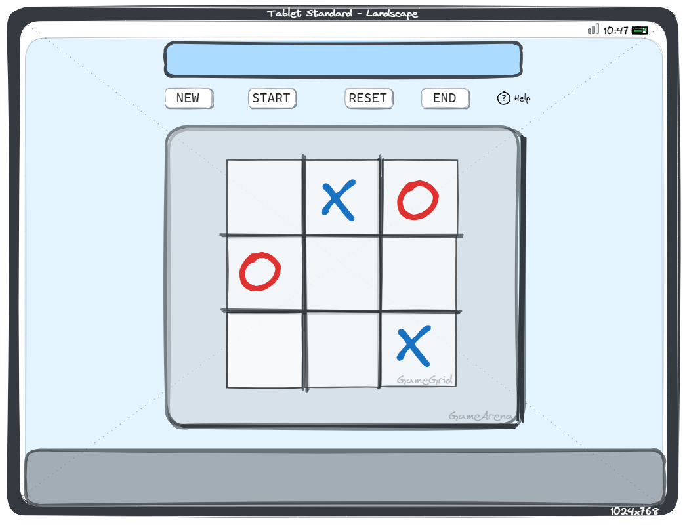
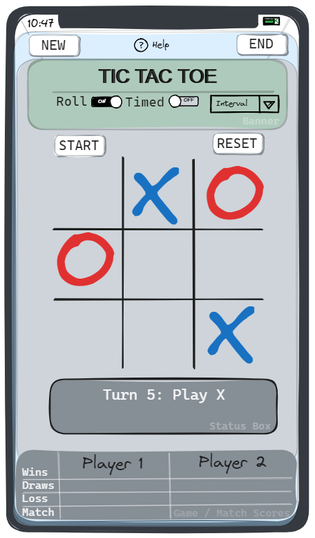

# `Mini_TicTacToe`
> _"A solved, futile, game (as a known problem solved) used to demonstrate the principles of front end web development and interactive web app design, development and deployment using version source control."_
## 1.0 Introduction 🚧
> Complete: ❓ | Review: 📝 | To Do: 📌

***Tic Tac Toe*** origins can be traced back to its progenitor of three-in-a-row boards as fare back to ancient Egypt (since 1300 BC). Early variations of tic-tac-toe come from the Roman Empire (known as *terni lapilli/three pebbles at a time*). Another variation is [three man morris](https://en.wikipedia.org/wiki/Three_men%27s_morris). For more on the [history](https://en.wikipedia.org/wiki/Tic-tac-toe#History).

Tic Tac Toe is a typical entry point for student developers to learning simple coding precepts and software development projects, hence it was chosen for this project. See the following goals in sections 1.1 Goals, 2.0 Solutions and 4.0 User Experience for goals and motivations. Additionally, it can get advanced with entry points into algorithm study via disciplines of Combinatorics and types of Artificial Intelligence algorithms; this is out of scope for this projects goals and learning outcomes.

Source: https://en.wikipedia.org/wiki/Tic-tac-toe

[](https://github.com/marketplace/actions/super-linter)

### 1.1 Goals ✅
> `Simple Goals, bullets points`
#### 1.1.1 App Goals ✅

-  [x] To be a simple online game as a web applications demonstration.
-  [x] To have an interactive experience of playing a futile grid game, like Tic Tac Toe.
	- To have user feedback based on that user input.
	- To have user control over the game experience by user input.
	- To have an error / execution flow free experience.
-  [x] To demonstrate the execution of a turn based game for 2 player.

For specific solution and user goals, see 2.0 Solution and 4.0 User Experience sections below.
#### 1.1.2 Project Goals ✅

-  [x] To follow the instructions and objective of the Code Institute Assessment Criteria for the *JavaScript Essentials* module.
	- Use of best practices in *User Experience* and Solution/Web Design in web development projects.
	- Use of *Front End Web Technologies* to build, linting (static analysis), validate, test and deploy.
	- Use of markdown formats for README.
	- Use of version control for project, source code, deployment and hosting using *Git/GitHub.com*.
-  [x] To build a simple interactive web app using the basics of *JavaScript*, *HTML* and *CSS*.
-  [x] To employ Frameworks from *CSS* and *JavaScript* if appropriate and decided for.
	- *TailwindsCSS* is a preferred *CSS Framework* to build any design, directly in your *HTML*; using a *Locality of Behaviour* principle, over a *Separation of Concerns*.
	- *AlpineJS* is a preferred *VUE/jQuery* like Framework for rugged, minimal tool for composing behaviour directly in your markup; using a *Locality of Behaviour* principle, over a *Separation of Concerns*.
-  [x] To demonstrate the author's technical and *academic* writing skills in this `README.md`.
	- The author is an expressive, detailed orientated and explicit technical writer.
	- This technical writing is inside a academic context, with goals are to show learnings and capabilities.
-  [x] To showcase the author's technical knowledge, supplementary skills beyond the scope of this assignment, such as:
	- Agile Software & Project Management and appropriate level according to scope/complexity.
	- Any Decision Records
	- Mermaid Diagrams

### 1.2 Live App 🚧

Name | App | Repo Name | Repo URL
--- | --- |--- | --- |
`Project` | https://{{app-slug}}.github.io | `Repo` | https://github.com/iPoetDev/{{repo-slug}} |
***
### 1.3 App Visual 🚧


amiresponsive.co.uk/ | URI: AmIResponsive

***
> ::
***
## 2.0 Solution: **`Tic Tac Toe`** - A Grid Game 🚧✅
> Complete: ✅ | Review: ❓
### 2.1 Game Play ✅✅

- Tic-tac-toe is played on a three-by-three grid by two players, who alternately place the marks X and O in one of the nine spaces in the grid <sup><b>(1)</b></sup>.
	- There is no universally agreed rule as to who plays first.
	- Convention is used so that **`X`** is played first.
- Players soon discover that the best play from both parties leads to a draw as an optimal strategy. It is sometimes known as [futile game](https://en.wikipedia.org/wiki/Futile_game) <sup><b>(2)</b></sup> in game theory.

**`Example GamePlay`: Wikipedia.com <sup><b>(1)</b></sup> **


#### This Game Play ✅✅

- When player starts a round, they click the start button.
- The First move is, by convention, signalled by the **`X`** first move.
- The 1st Player is marked by a `BLUE` marker, i.e. item or game token,
- The 2nd Player is automatically marked by a `RED` marker, i.e. item or game token.
- Players can only mark a turn/position once.
	- `Time Limits` is a potential feature (Credit: [Tic Tac Toe Web Browser Gameplay)](https://github.com/miloszmisiek/ci_p2_tictactoe#gameplay) <sup><b>(3)</b></sup>
		- Player has **time limit** for his move equals to **15 seconds**.
		- Timer starts when Player press **START/RESTART** button and is reset after every turn.
- To **win** the game, the first to mark 3 indices/rows in any direction, along one of these incidence structures.
	- 3 Horizontal Wins
	- 3 Vertical Wins
	- 2 Diagonal Wins
- To **draw** the game, is when no further win along the above indices/row and all spaces are occupied or the next turn player concedes to a draw.
`Winning Options: 3 indices in a row`

- Given that Tic Tac Toe is a futile game, Players may want to have a series a rounds of games
	- Each round is a sets
	- Best of `2n+1` sets is a match.
- Therefore, to score these rounds of games, scoring each will need to be tallied and kept.
	- **`Scoring`**: is a potential feature. Credit: [Tic Tac Toe Web Browser Gameplay)](https://github.com/miloszmisiek/ci_p2_tictactoe#gameplay) <sup><b>(3)</b></sup>
		- After every result, the respective score counter is updated for each player.
- To play a new game, Player can press **RESTART** button.
	- If a player wants to start over and have a new match: Players can press the **RESET MATCH**
- More on a Perfect Game strategies on Wikipedia **(1)**.


```
<small><sup><b>1</b></sup>: Source: <a href="https://en.wikipedia.org/wiki/Tic-tac-toe#Gameplay">https://en.wikipedia.org/wiki/Tic-tac-toe#Gameplay</a></small>
<small><sup><b>2</b></sup>: Source: <a href="https://en.wikipedia.org/wiki/Futile_game">https://en.wikipedia.org/wiki/Futile_game</a></small>
<small><sup><b>3</b></sup>: Source: <a href="https://github.com/miloszmisiek/ci_p2_tictactoe#gameplay">https://github.com/miloszmisiek/ci_p2_tictactoe#gameplay</a>, Author: <b>Milosz Misiek</b> <i>https://github.com/miloszmisiek</i> (2021), Last Accessed: Dec 12, 2023</small>
```

***
### 2.2 Game Arena ✅❓

**`Key Components`**: See [4.? Features]() below for fuller outline and description.

| Arena/App Features      | Parent Feature   | Form Factor                                                                                                                                                                                                                                                                                                                                                                                                                                                                                                                                                                                                                                                                                                                                                                                                                                                                                                                                                                                                                                                                                                                                                       | Location                       | Outline                                                                                                                                                                                                                                                                                                                                                                                                                                                                                                                                                                                                                                                                                                                                                                                                                                                                                                                                                                                                                                                                                                                                                     | Elements                                                                                                                                                                                                                                                                                                                                                                                                                                                                                                                                                                                                                                                                                                                                                                                                                                                                                                                                                                                                                                                                                                                                                                  | Interactions                                                                                                                                                                                                                                                                                                                                                                                                                                                                                                                                                                                                                                                                                                                                                                                                                                                                                                                                                                                                                                                                                                                                                     | Version |
|:-------------------|:-----------------|:------------------------------------------------------------------------------------------------------------------------------------------------------------------------------------------------------------------------------------------------------------------------------------------------------------------------------------------------------------------------------------------------------------------------------------------------------------------------------------------------------------------------------------------------------------------------------------------------------------------------------------------------------------------------------------------------------------------------------------------------------------------------------------------------------------------------------------------------------------------------------------------------------------------------------------------------------------------------------------------------------------------------------------------------------------------------------------------------------------------------------------------------------------------|:-------------------------------|:------------------------------------------------------------------------------------------------------------------------------------------------------------------------------------------------------------------------------------------------------------------------------------------------------------------------------------------------------------------------------------------------------------------------------------------------------------------------------------------------------------------------------------------------------------------------------------------------------------------------------------------------------------------------------------------------------------------------------------------------------------------------------------------------------------------------------------------------------------------------------------------------------------------------------------------------------------------------------------------------------------------------------------------------------------------------------------------------------------------------------------------------------------|:--------------------------------------------------------------------------------------------------------------------------------------------------------------------------------------------------------------------------------------------------------------------------------------------------------------------------------------------------------------------------------------------------------------------------------------------------------------------------------------------------------------------------------------------------------------------------------------------------------------------------------------------------------------------------------------------------------------------------------------------------------------------------------------------------------------------------------------------------------------------------------------------------------------------------------------------------------------------------------------------------------------------------------------------------------------------------------------------------------------------------------------------------------------------------|:-----------------------------------------------------------------------------------------------------------------------------------------------------------------------------------------------------------------------------------------------------------------------------------------------------------------------------------------------------------------------------------------------------------------------------------------------------------------------------------------------------------------------------------------------------------------------------------------------------------------------------------------------------------------------------------------------------------------------------------------------------------------------------------------------------------------------------------------------------------------------------------------------------------------------------------------------------------------------------------------------------------------------------------------------------------------------------------------------------------------------------------------------------------------|:--------|
| Web Page           | --               | All:<br style="--tw-border-spacing-x: 0; --tw-border-spacing-y: 0; --tw-translate-x: 0; --tw-translate-y: 0; --tw-rotate: 0; --tw-skew-x: 0; --tw-skew-y: 0; --tw-scale-x: 1; --tw-scale-y: 1; --tw-pan-x: ; --tw-pan-y: ; --tw-pinch-zoom: ; --tw-scroll-snap-strictness: proximity; --tw-gradient-from-position: ; --tw-gradient-via-position: ; --tw-gradient-to-position: ; --tw-ordinal: ; --tw-slashed-zero: ; --tw-numeric-figure: ; --tw-numeric-spacing: ; --tw-numeric-fraction: ; --tw-ring-inset: ; --tw-ring-offset-width: 0px; --tw-ring-offset-color: #fff; --tw-ring-color: rgb(59 130 246 / 0.5); --tw-ring-offset-shadow: 0 0 #0000; --tw-ring-shadow: 0 0 #0000; --tw-shadow: 0 0 #0000; --tw-shadow-colored: 0 0 #0000; --tw-blur: ; --tw-brightness: ; --tw-contrast: ; --tw-grayscale: ; --tw-hue-rotate: ; --tw-invert: ; --tw-saturate: ; --tw-sepia: ; --tw-drop-shadow: ; --tw-backdrop-blur: ; --tw-backdrop-brightness: ; --tw-backdrop-contrast: ; --tw-backdrop-grayscale: ; --tw-backdrop-hue-rotate: ; --tw-backdrop-invert: ; --tw-backdrop-opacity: ; --tw-backdrop-saturate: ; --tw-backdrop-sepia: ;">Desktop, Tablet, Mobile | Page                           | HTML                                                                                                                                                                                                                                                                                                                                                                                                                                                                                                                                                                                                                                                                                                                                                                                                                                                                                                                                                                                                                                                                                                                                                        | HTML Semantics                                                                                                                                                                                                                                                                                                                                                                                                                                                                                                                                                                                                                                                                                                                                                                                                                                                                                                                                                                                                                                                                                                                                                            | --                                                                                                                                                                                                                                                                                                                                                                                                                                                                                                                                                                                                                                                                                                                                                                                                                                                                                                                                                                                                                                                                                                                                                               |         |
| Web App            | Web Page         | All:<br style="--tw-border-spacing-x: 0; --tw-border-spacing-y: 0; --tw-translate-x: 0; --tw-translate-y: 0; --tw-rotate: 0; --tw-skew-x: 0; --tw-skew-y: 0; --tw-scale-x: 1; --tw-scale-y: 1; --tw-pan-x: ; --tw-pan-y: ; --tw-pinch-zoom: ; --tw-scroll-snap-strictness: proximity; --tw-gradient-from-position: ; --tw-gradient-via-position: ; --tw-gradient-to-position: ; --tw-ordinal: ; --tw-slashed-zero: ; --tw-numeric-figure: ; --tw-numeric-spacing: ; --tw-numeric-fraction: ; --tw-ring-inset: ; --tw-ring-offset-width: 0px; --tw-ring-offset-color: #fff; --tw-ring-color: rgb(59 130 246 / 0.5); --tw-ring-offset-shadow: 0 0 #0000; --tw-ring-shadow: 0 0 #0000; --tw-shadow: 0 0 #0000; --tw-shadow-colored: 0 0 #0000; --tw-blur: ; --tw-brightness: ; --tw-contrast: ; --tw-grayscale: ; --tw-hue-rotate: ; --tw-invert: ; --tw-saturate: ; --tw-sepia: ; --tw-drop-shadow: ; --tw-backdrop-blur: ; --tw-backdrop-brightness: ; --tw-backdrop-contrast: ; --tw-backdrop-grayscale: ; --tw-backdrop-hue-rotate: ; --tw-backdrop-invert: ; --tw-backdrop-opacity: ; --tw-backdrop-saturate: ; --tw-backdrop-sepia: ;">Desktop, Tablet, Mobile | Page                           | SPA, Simple, Alpine X-Data&nbsp;                                                                                                                                                                                                                                                                                                                                                                                                                                                                                                                                                                                                                                                                                                                                                                                                                                                                                                                                                                                                                                                                                                                            | Loads JS&nbsp;                                                                                                                                                                                                                                                                                                                                                                                                                                                                                                                                                                                                                                                                                                                                                                                                                                                                                                                                                                                                                                                                                                                                                            | --                                                                                                                                                                                                                                                                                                                                                                                                                                                                                                                                                                                                                                                                                                                                                                                                                                                                                                                                                                                                                                                                                                                                                               |         |
| Game Banner        | Web App          | All: <br>Desktop, Tablet, Mobile                                                                                                                                                                                                                                                                                                                                                                                                                                                                                                                                                                                                                                                                                                                                                                                                                                                                                                                                                                                                                                                                                                                                  | 1st Row,<br>Top of Area/Header | Header, Headings<br>                                                                                                                                                                                                                                                                                                                                                                                                                                                                                                                                                                                                                                                                                                                                                                                                                                                                                                                                                                                                                                                                                                                                        | Game Title,<br>In-Game Controls                                                                                                                                                                                                                                                                                                                                                                                                                                                                                                                                                                                                                                                                                                                                                                                                                                                                                                                                                                                                                                                                                                                                           | --                                                                                                                                                                                                                                                                                                                                                                                                                                                                                                                                                                                                                                                                                                                                                                                                                                                                                                                                                                                                                                                                                                                                                               |         |
| Game Title         | Game Banner      | All:<br style="--tw-border-spacing-x: 0; --tw-border-spacing-y: 0; --tw-translate-x: 0; --tw-translate-y: 0; --tw-rotate: 0; --tw-skew-x: 0; --tw-skew-y: 0; --tw-scale-x: 1; --tw-scale-y: 1; --tw-pan-x: ; --tw-pan-y: ; --tw-pinch-zoom: ; --tw-scroll-snap-strictness: proximity; --tw-gradient-from-position: ; --tw-gradient-via-position: ; --tw-gradient-to-position: ; --tw-ordinal: ; --tw-slashed-zero: ; --tw-numeric-figure: ; --tw-numeric-spacing: ; --tw-numeric-fraction: ; --tw-ring-inset: ; --tw-ring-offset-width: 0px; --tw-ring-offset-color: #fff; --tw-ring-color: rgb(59 130 246 / 0.5); --tw-ring-offset-shadow: 0 0 #0000; --tw-ring-shadow: 0 0 #0000; --tw-shadow: 0 0 #0000; --tw-shadow-colored: 0 0 #0000; --tw-blur: ; --tw-brightness: ; --tw-contrast: ; --tw-grayscale: ; --tw-hue-rotate: ; --tw-invert: ; --tw-saturate: ; --tw-sepia: ; --tw-drop-shadow: ; --tw-backdrop-blur: ; --tw-backdrop-brightness: ; --tw-backdrop-contrast: ; --tw-backdrop-grayscale: ; --tw-backdrop-hue-rotate: ; --tw-backdrop-invert: ; --tw-backdrop-opacity: ; --tw-backdrop-saturate: ; --tw-backdrop-sepia: ;">Desktop, Tablet, Mobile |  2nd Row,&nbsp;<br>Game Banner | Headings                                                                                                                                                                                                                                                                                                                                                                                                                                                                                                                                                                                                                                                                                                                                                                                                                                                                                                                                                                                                                                                                                                                                                    | Text                                                                                                                                                                                                                                                                                                                                                                                                                                                                                                                                                                                                                                                                                                                                                                                                                                                                                                                                                                                                                                                                                                                                                                      | --                                                                                                                                                                                                                                                                                                                                                                                                                                                                                                                                                                                                                                                                                                                                                                                                                                                                                                                                                                                                                                                                                                                                                               |         |
| In-Game Controls   | Game Banner      | All:<br style="--tw-border-spacing-x: 0; --tw-border-spacing-y: 0; --tw-translate-x: 0; --tw-translate-y: 0; --tw-rotate: 0; --tw-skew-x: 0; --tw-skew-y: 0; --tw-scale-x: 1; --tw-scale-y: 1; --tw-pan-x: ; --tw-pan-y: ; --tw-pinch-zoom: ; --tw-scroll-snap-strictness: proximity; --tw-gradient-from-position: ; --tw-gradient-via-position: ; --tw-gradient-to-position: ; --tw-ordinal: ; --tw-slashed-zero: ; --tw-numeric-figure: ; --tw-numeric-spacing: ; --tw-numeric-fraction: ; --tw-ring-inset: ; --tw-ring-offset-width: 0px; --tw-ring-offset-color: #fff; --tw-ring-color: rgb(59 130 246 / 0.5); --tw-ring-offset-shadow: 0 0 #0000; --tw-ring-shadow: 0 0 #0000; --tw-shadow: 0 0 #0000; --tw-shadow-colored: 0 0 #0000; --tw-blur: ; --tw-brightness: ; --tw-contrast: ; --tw-grayscale: ; --tw-hue-rotate: ; --tw-invert: ; --tw-saturate: ; --tw-sepia: ; --tw-drop-shadow: ; --tw-backdrop-blur: ; --tw-backdrop-brightness: ; --tw-backdrop-contrast: ; --tw-backdrop-grayscale: ; --tw-backdrop-hue-rotate: ; --tw-backdrop-invert: ; --tw-backdrop-opacity: ; --tw-backdrop-saturate: ; --tw-backdrop-sepia: ;">Desktop, Tablet, Mobile |           2nd Row, Game Banner | Template,<br>Components<br><br>                                                                                                                                                                                                                                                                                                                                                                                                                                                                                                                                                                                                                                                                                                                                                                                                                                                                                                                                                                                                                                                                                                                             | Game Timer/Controls,<br>Game FAQ Button                                                                                                                                                                                                                                                                                                                                                                                                                                                                                                                                                                                                                                                                                                                                                                                                                                                                                                                                                                                                                                                                                                                                   | --                                                                                                                                                                                                                                                                                                                                                                                                                                                                                                                                                                                                                                                                                                                                                                                                                                                                                                                                                                                                                                                                                                                                                               |         |
| Game Timer         | In-Game Controls | Desktop &amp; Tablet                                                                                                                                                                                                                                                                                                                                                                                                                                                                                                                                                                                                                                                                                                                                                                                                                                                                                                                                                                                                                                                                                                                                              |           2nd Row, Game Banner | Counts down the assigned set interval.                                                                                                                                                                                                                                                                                                                                                                                                                                                                                                                                                                                                                                                                                                                                                                                                                                                                                                                                                                                                                                                                                                                      | External Library,<br>InnerHTML Text                                                                                                                                                                                                                                                                                                                                                                                                                                                                                                                                                                                                                                                                                                                                                                                                                                                                                                                                                                                                                                                                                                                                       | Timer, On Click                                                                                                                                                                                                                                                                                                                                                                                                                                                                                                                                                                                                                                                                                                                                                                                                                                                                                                                                                                                                                                                                                                                                                  |         |
| Game FAQ Button    | In-Game Controls | All:<br style="--tw-border-spacing-x: 0; --tw-border-spacing-y: 0; --tw-translate-x: 0; --tw-translate-y: 0; --tw-rotate: 0; --tw-skew-x: 0; --tw-skew-y: 0; --tw-scale-x: 1; --tw-scale-y: 1; --tw-pan-x: ; --tw-pan-y: ; --tw-pinch-zoom: ; --tw-scroll-snap-strictness: proximity; --tw-gradient-from-position: ; --tw-gradient-via-position: ; --tw-gradient-to-position: ; --tw-ordinal: ; --tw-slashed-zero: ; --tw-numeric-figure: ; --tw-numeric-spacing: ; --tw-numeric-fraction: ; --tw-ring-inset: ; --tw-ring-offset-width: 0px; --tw-ring-offset-color: #fff; --tw-ring-color: rgb(59 130 246 / 0.5); --tw-ring-offset-shadow: 0 0 #0000; --tw-ring-shadow: 0 0 #0000; --tw-shadow: 0 0 #0000; --tw-shadow-colored: 0 0 #0000; --tw-blur: ; --tw-brightness: ; --tw-contrast: ; --tw-grayscale: ; --tw-hue-rotate: ; --tw-invert: ; --tw-saturate: ; --tw-sepia: ; --tw-drop-shadow: ; --tw-backdrop-blur: ; --tw-backdrop-brightness: ; --tw-backdrop-contrast: ; --tw-backdrop-grayscale: ; --tw-backdrop-hue-rotate: ; --tw-backdrop-invert: ; --tw-backdrop-opacity: ; --tw-backdrop-saturate: ; --tw-backdrop-sepia: ;">Desktop, Tablet, Mobile |           2nd Row, Game Banner | Button                                                                                                                                                                                                                                                                                                                                                                                                                                                                                                                                                                                                                                                                                                                                                                                                                                                                                                                                                                                                                                                                                                                                                      | In Page Modal                                                                                                                                                                                                                                                                                                                                                                                                                                                                                                                                                                                                                                                                                                                                                                                                                                                                                                                                                                                                                                                                                                                                                             | Opens Modal<br>Button On Click                                                                                                                                                                                                                                                                                                                                                                                                                                                                                                                                                                                                                                                                                                                                                                                                                                                                                                                                                                                                                                                                                                                                   |         |
| Game Board         | Web App          | All:<br style="--tw-border-spacing-x: 0; --tw-border-spacing-y: 0; --tw-translate-x: 0; --tw-translate-y: 0; --tw-rotate: 0; --tw-skew-x: 0; --tw-skew-y: 0; --tw-scale-x: 1; --tw-scale-y: 1; --tw-pan-x: ; --tw-pan-y: ; --tw-pinch-zoom: ; --tw-scroll-snap-strictness: proximity; --tw-gradient-from-position: ; --tw-gradient-via-position: ; --tw-gradient-to-position: ; --tw-ordinal: ; --tw-slashed-zero: ; --tw-numeric-figure: ; --tw-numeric-spacing: ; --tw-numeric-fraction: ; --tw-ring-inset: ; --tw-ring-offset-width: 0px; --tw-ring-offset-color: #fff; --tw-ring-color: rgb(59 130 246 / 0.5); --tw-ring-offset-shadow: 0 0 #0000; --tw-ring-shadow: 0 0 #0000; --tw-shadow: 0 0 #0000; --tw-shadow-colored: 0 0 #0000; --tw-blur: ; --tw-brightness: ; --tw-contrast: ; --tw-grayscale: ; --tw-hue-rotate: ; --tw-invert: ; --tw-saturate: ; --tw-sepia: ; --tw-drop-shadow: ; --tw-backdrop-blur: ; --tw-backdrop-brightness: ; --tw-backdrop-contrast: ; --tw-backdrop-grayscale: ; --tw-backdrop-hue-rotate: ; --tw-backdrop-invert: ; --tw-backdrop-opacity: ; --tw-backdrop-saturate: ; --tw-backdrop-sepia: ;">Desktop, Tablet, Mobile | Centre of Area                 | Template,<br>Grid, Button                                                                                                                                                                                                                                                                                                                                                                                                                                                                                                                                                                                                                                                                                                                                                                                                                                                                                                                                                                                                                                                                                                                                   | Grid, 0-3<br>Grid, 3-6<br style="--tw-border-spacing-x: 0; --tw-border-spacing-y: 0; --tw-translate-x: 0; --tw-translate-y: 0; --tw-rotate: 0; --tw-skew-x: 0; --tw-skew-y: 0; --tw-scale-x: 1; --tw-scale-y: 1; --tw-pan-x: ; --tw-pan-y: ; --tw-pinch-zoom: ; --tw-scroll-snap-strictness: proximity; --tw-gradient-from-position: ; --tw-gradient-via-position: ; --tw-gradient-to-position: ; --tw-ordinal: ; --tw-slashed-zero: ; --tw-numeric-figure: ; --tw-numeric-spacing: ; --tw-numeric-fraction: ; --tw-ring-inset: ; --tw-ring-offset-width: 0px; --tw-ring-offset-color: #fff; --tw-ring-color: rgb(59 130 246 / 0.5); --tw-ring-offset-shadow: 0 0 #0000; --tw-ring-shadow: 0 0 #0000; --tw-shadow: 0 0 #0000; --tw-shadow-colored: 0 0 #0000; --tw-blur: ; --tw-brightness: ; --tw-contrast: ; --tw-grayscale: ; --tw-hue-rotate: ; --tw-invert: ; --tw-saturate: ; --tw-sepia: ; --tw-drop-shadow: ; --tw-backdrop-blur: ; --tw-backdrop-brightness: ; --tw-backdrop-contrast: ; --tw-backdrop-grayscale: ; --tw-backdrop-hue-rotate: ; --tw-backdrop-invert: ; --tw-backdrop-opacity: ; --tw-backdrop-saturate: ; --tw-backdrop-sepia: ;">Grid, 6-9<br> | Button On Click                                                                                                                                                                                                                                                                                                                                                                                                                                                                                                                                                                                                                                                                                                                                                                                                                                                                                                                                                                                                                                                                                                                                                  |         |
| Game Messages      | Web App          | All:<br style="--tw-border-spacing-x: 0; --tw-border-spacing-y: 0; --tw-translate-x: 0; --tw-translate-y: 0; --tw-rotate: 0; --tw-skew-x: 0; --tw-skew-y: 0; --tw-scale-x: 1; --tw-scale-y: 1; --tw-pan-x: ; --tw-pan-y: ; --tw-pinch-zoom: ; --tw-scroll-snap-strictness: proximity; --tw-gradient-from-position: ; --tw-gradient-via-position: ; --tw-gradient-to-position: ; --tw-ordinal: ; --tw-slashed-zero: ; --tw-numeric-figure: ; --tw-numeric-spacing: ; --tw-numeric-fraction: ; --tw-ring-inset: ; --tw-ring-offset-width: 0px; --tw-ring-offset-color: #fff; --tw-ring-color: rgb(59 130 246 / 0.5); --tw-ring-offset-shadow: 0 0 #0000; --tw-ring-shadow: 0 0 #0000; --tw-shadow: 0 0 #0000; --tw-shadow-colored: 0 0 #0000; --tw-blur: ; --tw-brightness: ; --tw-contrast: ; --tw-grayscale: ; --tw-hue-rotate: ; --tw-invert: ; --tw-saturate: ; --tw-sepia: ; --tw-drop-shadow: ; --tw-backdrop-blur: ; --tw-backdrop-brightness: ; --tw-backdrop-contrast: ; --tw-backdrop-grayscale: ; --tw-backdrop-hue-rotate: ; --tw-backdrop-invert: ; --tw-backdrop-opacity: ; --tw-backdrop-saturate: ; --tw-backdrop-sepia: ;">Desktop, Tablet, Mobile |         2nd Row,&nbsp;<br>Area | Template,<br style="--tw-border-spacing-x: 0; --tw-border-spacing-y: 0; --tw-translate-x: 0; --tw-translate-y: 0; --tw-rotate: 0; --tw-skew-x: 0; --tw-skew-y: 0; --tw-scale-x: 1; --tw-scale-y: 1; --tw-pan-x: ; --tw-pan-y: ; --tw-pinch-zoom: ; --tw-scroll-snap-strictness: proximity; --tw-gradient-from-position: ; --tw-gradient-via-position: ; --tw-gradient-to-position: ; --tw-ordinal: ; --tw-slashed-zero: ; --tw-numeric-figure: ; --tw-numeric-spacing: ; --tw-numeric-fraction: ; --tw-ring-inset: ; --tw-ring-offset-width: 0px; --tw-ring-offset-color: #fff; --tw-ring-color: rgb(59 130 246 / 0.5); --tw-ring-offset-shadow: 0 0 #0000; --tw-ring-shadow: 0 0 #0000; --tw-shadow: 0 0 #0000; --tw-shadow-colored: 0 0 #0000; --tw-blur: ; --tw-brightness: ; --tw-contrast: ; --tw-grayscale: ; --tw-hue-rotate: ; --tw-invert: ; --tw-saturate: ; --tw-sepia: ; --tw-drop-shadow: ; --tw-backdrop-blur: ; --tw-backdrop-brightness: ; --tw-backdrop-contrast: ; --tw-backdrop-grayscale: ; --tw-backdrop-hue-rotate: ; --tw-backdrop-invert: ; --tw-backdrop-opacity: ; --tw-backdrop-saturate: ; --tw-backdrop-sepia: ;">Components   | InnerHTML Text                                                                                                                                                                                                                                                                                                                                                                                                                                                                                                                                                                                                                                                                                                                                                                                                                                                                                                                                                                                                                                                                                                                                                            | &nbsp;On Update, Update DOM                                                                                                                                                                                                                                                                                                                                                                                                                                                                                                                                                                                                                                                                                                                                                                                                                                                                                                                                                                                                                                                                                                                                      |         |
| Game Controls      | Web App          | All:<br style="--tw-border-spacing-x: 0; --tw-border-spacing-y: 0; --tw-translate-x: 0; --tw-translate-y: 0; --tw-rotate: 0; --tw-skew-x: 0; --tw-skew-y: 0; --tw-scale-x: 1; --tw-scale-y: 1; --tw-pan-x: ; --tw-pan-y: ; --tw-pinch-zoom: ; --tw-scroll-snap-strictness: proximity; --tw-gradient-from-position: ; --tw-gradient-via-position: ; --tw-gradient-to-position: ; --tw-ordinal: ; --tw-slashed-zero: ; --tw-numeric-figure: ; --tw-numeric-spacing: ; --tw-numeric-fraction: ; --tw-ring-inset: ; --tw-ring-offset-width: 0px; --tw-ring-offset-color: #fff; --tw-ring-color: rgb(59 130 246 / 0.5); --tw-ring-offset-shadow: 0 0 #0000; --tw-ring-shadow: 0 0 #0000; --tw-shadow: 0 0 #0000; --tw-shadow-colored: 0 0 #0000; --tw-blur: ; --tw-brightness: ; --tw-contrast: ; --tw-grayscale: ; --tw-hue-rotate: ; --tw-invert: ; --tw-saturate: ; --tw-sepia: ; --tw-drop-shadow: ; --tw-backdrop-blur: ; --tw-backdrop-brightness: ; --tw-backdrop-contrast: ; --tw-backdrop-grayscale: ; --tw-backdrop-hue-rotate: ; --tw-backdrop-invert: ; --tw-backdrop-opacity: ; --tw-backdrop-saturate: ; --tw-backdrop-sepia: ;">Desktop, Tablet, Mobile | Bottom of Game Board           | Template,<br style="--tw-border-spacing-x: 0; --tw-border-spacing-y: 0; --tw-translate-x: 0; --tw-translate-y: 0; --tw-rotate: 0; --tw-skew-x: 0; --tw-skew-y: 0; --tw-scale-x: 1; --tw-scale-y: 1; --tw-pan-x: ; --tw-pan-y: ; --tw-pinch-zoom: ; --tw-scroll-snap-strictness: proximity; --tw-gradient-from-position: ; --tw-gradient-via-position: ; --tw-gradient-to-position: ; --tw-ordinal: ; --tw-slashed-zero: ; --tw-numeric-figure: ; --tw-numeric-spacing: ; --tw-numeric-fraction: ; --tw-ring-inset: ; --tw-ring-offset-width: 0px; --tw-ring-offset-color: #fff; --tw-ring-color: rgb(59 130 246 / 0.5); --tw-ring-offset-shadow: 0 0 #0000; --tw-ring-shadow: 0 0 #0000; --tw-shadow: 0 0 #0000; --tw-shadow-colored: 0 0 #0000; --tw-blur: ; --tw-brightness: ; --tw-contrast: ; --tw-grayscale: ; --tw-hue-rotate: ; --tw-invert: ; --tw-saturate: ; --tw-sepia: ; --tw-drop-shadow: ; --tw-backdrop-blur: ; --tw-backdrop-brightness: ; --tw-backdrop-contrast: ; --tw-backdrop-grayscale: ; --tw-backdrop-hue-rotate: ; --tw-backdrop-invert: ; --tw-backdrop-opacity: ; --tw-backdrop-saturate: ; --tw-backdrop-sepia: ;">Grid, Button | Start Button<br style="--tw-border-spacing-x: 0; --tw-border-spacing-y: 0; --tw-translate-x: 0; --tw-translate-y: 0; --tw-rotate: 0; --tw-skew-x: 0; --tw-skew-y: 0; --tw-scale-x: 1; --tw-scale-y: 1; --tw-pan-x: ; --tw-pan-y: ; --tw-pinch-zoom: ; --tw-scroll-snap-strictness: proximity; --tw-gradient-from-position: ; --tw-gradient-via-position: ; --tw-gradient-to-position: ; --tw-ordinal: ; --tw-slashed-zero: ; --tw-numeric-figure: ; --tw-numeric-spacing: ; --tw-numeric-fraction: ; --tw-ring-inset: ; --tw-ring-offset-width: 0px; --tw-ring-offset-color: #fff; --tw-ring-color: rgb(59 130 246 / 0.5); --tw-ring-offset-shadow: 0 0 #0000; --tw-ring-shadow: 0 0 #0000; --tw-shadow: 0 0 #0000; --tw-shadow-colored: 0 0 #0000; --tw-blur: ; --tw-brightness: ; --tw-contrast: ; --tw-grayscale: ; --tw-hue-rotate: ; --tw-invert: ; --tw-saturate: ; --tw-sepia: ; --tw-drop-shadow: ; --tw-backdrop-blur: ; --tw-backdrop-brightness: ; --tw-backdrop-contrast: ; --tw-backdrop-grayscale: ; --tw-backdrop-hue-rotate: ; --tw-backdrop-invert: ; --tw-backdrop-opacity: ; --tw-backdrop-saturate: ; --tw-backdrop-sepia: ;">Reset Button            | Button On Click                                                                                                                                                                                                                                                                                                                                                                                                                                                                                                                                                                                                                                                                                                                                                                                                                                                                                                                                                                                                                                                                                                                                                  |         |
| Game Score         | Web App          | All:<br style="--tw-border-spacing-x: 0; --tw-border-spacing-y: 0; --tw-translate-x: 0; --tw-translate-y: 0; --tw-rotate: 0; --tw-skew-x: 0; --tw-skew-y: 0; --tw-scale-x: 1; --tw-scale-y: 1; --tw-pan-x: ; --tw-pan-y: ; --tw-pinch-zoom: ; --tw-scroll-snap-strictness: proximity; --tw-gradient-from-position: ; --tw-gradient-via-position: ; --tw-gradient-to-position: ; --tw-ordinal: ; --tw-slashed-zero: ; --tw-numeric-figure: ; --tw-numeric-spacing: ; --tw-numeric-fraction: ; --tw-ring-inset: ; --tw-ring-offset-width: 0px; --tw-ring-offset-color: #fff; --tw-ring-color: rgb(59 130 246 / 0.5); --tw-ring-offset-shadow: 0 0 #0000; --tw-ring-shadow: 0 0 #0000; --tw-shadow: 0 0 #0000; --tw-shadow-colored: 0 0 #0000; --tw-blur: ; --tw-brightness: ; --tw-contrast: ; --tw-grayscale: ; --tw-hue-rotate: ; --tw-invert: ; --tw-saturate: ; --tw-sepia: ; --tw-drop-shadow: ; --tw-backdrop-blur: ; --tw-backdrop-brightness: ; --tw-backdrop-contrast: ; --tw-backdrop-grayscale: ; --tw-backdrop-hue-rotate: ; --tw-backdrop-invert: ; --tw-backdrop-opacity: ; --tw-backdrop-saturate: ; --tw-backdrop-sepia: ;">Desktop, Tablet, Mobile | Bottom of Game Board           | Template,<br style="--tw-border-spacing-x: 0; --tw-border-spacing-y: 0; --tw-translate-x: 0; --tw-translate-y: 0; --tw-rotate: 0; --tw-skew-x: 0; --tw-skew-y: 0; --tw-scale-x: 1; --tw-scale-y: 1; --tw-pan-x: ; --tw-pan-y: ; --tw-pinch-zoom: ; --tw-scroll-snap-strictness: proximity; --tw-gradient-from-position: ; --tw-gradient-via-position: ; --tw-gradient-to-position: ; --tw-ordinal: ; --tw-slashed-zero: ; --tw-numeric-figure: ; --tw-numeric-spacing: ; --tw-numeric-fraction: ; --tw-ring-inset: ; --tw-ring-offset-width: 0px; --tw-ring-offset-color: #fff; --tw-ring-color: rgb(59 130 246 / 0.5); --tw-ring-offset-shadow: 0 0 #0000; --tw-ring-shadow: 0 0 #0000; --tw-shadow: 0 0 #0000; --tw-shadow-colored: 0 0 #0000; --tw-blur: ; --tw-brightness: ; --tw-contrast: ; --tw-grayscale: ; --tw-hue-rotate: ; --tw-invert: ; --tw-saturate: ; --tw-sepia: ; --tw-drop-shadow: ; --tw-backdrop-blur: ; --tw-backdrop-brightness: ; --tw-backdrop-contrast: ; --tw-backdrop-grayscale: ; --tw-backdrop-hue-rotate: ; --tw-backdrop-invert: ; --tw-backdrop-opacity: ; --tw-backdrop-saturate: ; --tw-backdrop-sepia: ;">Components   | InnerHTML Text                                                                                                                                                                                                                                                                                                                                                                                                                                                                                                                                                                                                                                                                                                                                                                                                                                                                                                                                                                                                                                                                                                                                                            | &nbsp;On Update, Update DOM                                                                                                                                                                                                                                                                                                                                                                                                                                                                                                                                                                                                                                                                                                                                                                                                                                                                                                                                                                                                                                                                                                                                      |         |
| Game Match Scoring | Web App          | All:<br style="--tw-border-spacing-x: 0; --tw-border-spacing-y: 0; --tw-translate-x: 0; --tw-translate-y: 0; --tw-rotate: 0; --tw-skew-x: 0; --tw-skew-y: 0; --tw-scale-x: 1; --tw-scale-y: 1; --tw-pan-x: ; --tw-pan-y: ; --tw-pinch-zoom: ; --tw-scroll-snap-strictness: proximity; --tw-gradient-from-position: ; --tw-gradient-via-position: ; --tw-gradient-to-position: ; --tw-ordinal: ; --tw-slashed-zero: ; --tw-numeric-figure: ; --tw-numeric-spacing: ; --tw-numeric-fraction: ; --tw-ring-inset: ; --tw-ring-offset-width: 0px; --tw-ring-offset-color: #fff; --tw-ring-color: rgb(59 130 246 / 0.5); --tw-ring-offset-shadow: 0 0 #0000; --tw-ring-shadow: 0 0 #0000; --tw-shadow: 0 0 #0000; --tw-shadow-colored: 0 0 #0000; --tw-blur: ; --tw-brightness: ; --tw-contrast: ; --tw-grayscale: ; --tw-hue-rotate: ; --tw-invert: ; --tw-saturate: ; --tw-sepia: ; --tw-drop-shadow: ; --tw-backdrop-blur: ; --tw-backdrop-brightness: ; --tw-backdrop-contrast: ; --tw-backdrop-grayscale: ; --tw-backdrop-hue-rotate: ; --tw-backdrop-invert: ; --tw-backdrop-opacity: ; --tw-backdrop-saturate: ; --tw-backdrop-sepia: ;">Desktop, Tablet, Mobile | In Overlay, In Page Modal      | Template,<br style="--tw-border-spacing-x: 0; --tw-border-spacing-y: 0; --tw-translate-x: 0; --tw-translate-y: 0; --tw-rotate: 0; --tw-skew-x: 0; --tw-skew-y: 0; --tw-scale-x: 1; --tw-scale-y: 1; --tw-pan-x: ; --tw-pan-y: ; --tw-pinch-zoom: ; --tw-scroll-snap-strictness: proximity; --tw-gradient-from-position: ; --tw-gradient-via-position: ; --tw-gradient-to-position: ; --tw-ordinal: ; --tw-slashed-zero: ; --tw-numeric-figure: ; --tw-numeric-spacing: ; --tw-numeric-fraction: ; --tw-ring-inset: ; --tw-ring-offset-width: 0px; --tw-ring-offset-color: #fff; --tw-ring-color: rgb(59 130 246 / 0.5); --tw-ring-offset-shadow: 0 0 #0000; --tw-ring-shadow: 0 0 #0000; --tw-shadow: 0 0 #0000; --tw-shadow-colored: 0 0 #0000; --tw-blur: ; --tw-brightness: ; --tw-contrast: ; --tw-grayscale: ; --tw-hue-rotate: ; --tw-invert: ; --tw-saturate: ; --tw-sepia: ; --tw-drop-shadow: ; --tw-backdrop-blur: ; --tw-backdrop-brightness: ; --tw-backdrop-contrast: ; --tw-backdrop-grayscale: ; --tw-backdrop-hue-rotate: ; --tw-backdrop-invert: ; --tw-backdrop-opacity: ; --tw-backdrop-saturate: ; --tw-backdrop-sepia: ;">Components   | InnerHTML Text<br>Start Match Button<br>Reset Match                                                                                                                                                                                                                                                                                                                                                                                                                                                                                                                                                                                                                                                                                                                                                                                                                                                                                                                                                                                                                                                                                                                       | Opens Modal<br style="--tw-border-spacing-x: 0; --tw-border-spacing-y: 0; --tw-translate-x: 0; --tw-translate-y: 0; --tw-rotate: 0; --tw-skew-x: 0; --tw-skew-y: 0; --tw-scale-x: 1; --tw-scale-y: 1; --tw-pan-x: ; --tw-pan-y: ; --tw-pinch-zoom: ; --tw-scroll-snap-strictness: proximity; --tw-gradient-from-position: ; --tw-gradient-via-position: ; --tw-gradient-to-position: ; --tw-ordinal: ; --tw-slashed-zero: ; --tw-numeric-figure: ; --tw-numeric-spacing: ; --tw-numeric-fraction: ; --tw-ring-inset: ; --tw-ring-offset-width: 0px; --tw-ring-offset-color: #fff; --tw-ring-color: rgb(59 130 246 / 0.5); --tw-ring-offset-shadow: 0 0 #0000; --tw-ring-shadow: 0 0 #0000; --tw-shadow: 0 0 #0000; --tw-shadow-colored: 0 0 #0000; --tw-blur: ; --tw-brightness: ; --tw-contrast: ; --tw-grayscale: ; --tw-hue-rotate: ; --tw-invert: ; --tw-saturate: ; --tw-sepia: ; --tw-drop-shadow: ; --tw-backdrop-blur: ; --tw-backdrop-brightness: ; --tw-backdrop-contrast: ; --tw-backdrop-grayscale: ; --tw-backdrop-hue-rotate: ; --tw-backdrop-invert: ; --tw-backdrop-opacity: ; --tw-backdrop-saturate: ; --tw-backdrop-sepia: ;">Button On Click |         |
***
### 2.3 Developer Motivations ✅✅

- This is a second shot attempt at Code Institute's *JavaScript Essentials* assignment.
- Tic Tac Toe has a simple implementation and is commonly used to instruct student developers in:
	1. Fundamentals of *JavaScript* for interactive web design.
	2. Basics of Game Design as a common learning pattern for interactivity.
- This README is demonstration of the author's technical writing and structured documentation skills.
- A preference for technical choices that demonstrate a principle of **Locality of Behaviour**
	-  **i.e.**: The behaviour of a unit of code should be as obvious as possible by looking only at that unit of code.
- The choice of *TailwindCSS*, as part of the requirements for the design and testing an interactive Front-End web application, is:
	- To build on the personal preference for pre-composed *CSS* styling and a opinionated library and or framework of styling.
	- Example of *Locality of Behaviour*.
- The choice of *AlpineJS*, as part of the requirement to implement Front-End interactivity a *JavaScript* libraries or frameworks, is:
	- One to minimise the employment of *JavaScript* on a lightweight minimal basis.
	- A minimal tooling to compose behaviour directly in the mark up, a modernised variant of *jQuery*.
	- Example of *Locality of Behaviour*.
- Aims to reduce complexity and not repeat the basis of the first attempt by using AlpineJS and TailwindCSS as framworks.
***
### 2.4 Future Features 🚧

**For versions beyond version 0.5 / Alpha **

- `Time Limits` is a potential feature
- **`Scoring`**: is a potential feature.

***
### 2.5 Open Source Influences ✅✅

This author-developer's project has a strong influence, code reuse, concept and implementation and bearing from [Scott Windon - Buy Him a Coffee]([Scott Windon | Linktree](https://linktr.ee/scottwindon "Buy Scot a Coffee").

- *CodePen*: [Scott Windon - AlpineJS Tic Tac Toe (codepen.io)](https://codepen.io/ScottWindon/pen/eYBMXQO "Scott Windon")
- *AlpineToolBox*: [Alpine Toolbox - Alpine.js Examples](https://www.alpinetoolbox.com/examples/)
	- Browsing for sources of implementation and showcase of AlpineJS projects.
	- Used for researching into the project and solution ideas.

**Why**: All Students reference former students previous code submissions and this is not an uncommon practice. Scott Windon's example is a good example of AlpineJS implementation, architecture and reference code. All Code will be commented and accredited as it is included into this solution and project.

**Shared Concepts**: Reused.
	- Design: Font: Gochi-Hand
	- JavaScript: AlpineJS in HTML and Game Code
	- JavaScript: App Game Code

***
> ::
***
## 3.0 Project 🚧
> Complete: ❓ | Review: 📝 | To Do: 📌

_This section is a summation of select key, pre-agile:
- _i) project decisions_
- _ii) project management activities_
- _iii) stages of the project delivery workflows from code to hosting_
- _iv) documentation requirements._
### 3.1 Key Project Decisions 🚧

> -  Learning Requirement: Any design decisions that contravene accepted user interaction, user experience design principles are **identified and described** (comments in code or a section in the README)

#### 3.1.1 Interactive Front-End Web Application as a Single Page Architecture

> To use HTML, CSS and JavaScript (native and or Libraries) as front end technologies

#### 3.1.2 To employ a principle of Locality of Behaviour before Separation of Concerns, as a leading technical design pattern.

- .

#### 3.1.3 Select a CSS Framework, like TailwindCSS, that demonstrate the Locality of Behaviour principle as a design pattern.

-
#### 3.1.4 Select a lightweight JavaScript Framework, like AlpineJS, that demonstrate the Locality of Behaviour principle and composability of behaviour.

-

***
### 3.2 Requirements ✅

To view the Project Assessments and Requirements, see the associated Repository's Wiki: [Wiki (Project)](https://github.com/iPoetDev/AlpineTicTacToe/wiki)

***
### 3.3 Workflow ✅

The following workflow is an extract, re-sorted, of the PASS and MERIT Learning Objectives from the assessment criteria. Repurposed to define a workflow from start to finish, in semantic categories/phases. If these are surmounted, then good performance will open the possibility to a higher performance.
#### 3.3.1 Design & UX

> - 🚧✅ **Learning Objective**: *Design an interactive Front-End web application using HTML and CSS and JavaScript based on the principles of user experience design, accessibility and responsivity*.
> 	- [ ] Design a web application that meets accessibility guidelines, follows the principles of UX design, and meets its given purpose.
> 	- [ ] Design the organisation of information on the page following the principles of user experience design.
> 	- [ ] Design a web application that presents a structured layout and navigation model, and meets its given purpose.
> 	- [ ] Design a website that meets accessibility guidelines.
> 	- [ ] Design interactivity for a web application that lets the user initiate and control actions, and gives feedback.
> - 🚧✅ **Learning Objective**: *Design an interactive Front-End web application using HTML and CSS and JavaScript based on the principles of user experience design, accessibility and responsivity*.
> 	- [ ] Implement a website that provides an excellent solution to the key project goals, demands and expectations.
> 	- [ ] Implement a web application whose purpose is immediately evident to a new user.
> 	- [ ] Design a website with a flow of information layout and interaction feedback that is clear and unambiguous.
> - 🚧✅ **Learning Objective**: *Test a front-end web application through the development, implementation and deployment stages*
> 	- [ ] Code all external links to open in a separate tab when clicked.
> 	- [ ] If used, implement clear navigation to allow users to find resources on the site intuitively.
> 	- [ ] Present the finished website with clearly understandable site-specific content, rather than Lorem Ipsum placeholder text.
> - 🚧✅ **Learning Objective**: *Implement Front-End interactivity, using core JavaScript, JavaScript libraries or frameworks*.
> 	- [ ] Design a web application that lets the user initiate and control actions and gives feedback
##### 3.3.1.1 Graphics & Content

> - 🚧✅ <ins><b>Learning Objective</b>: <i>Design an interactive Front-End web application using HTML and CSS and JavaScript based on the principles of user experience design, accessibility and responsivity</i>.</ins>
> 	- [ ] Implement an interactive web application that incorporates images or graphics of usable resolution, legible, unobscured text, consistent styling, undistracted foregrounds.
> 	- [ ] Ensure that foreground information is never distracted by backgrounds.
> 	- [ ] Include graphics that are consistent in style and colour.
> 	- [ ] Design a website that meets accessibility guidelines (e.g. contrast between background and foreground colours to cater for the visually impaired).
> - 🚧✅ <ins><b>Learning Objective</b>: <i>Test a front-end web application through the development, implementation and deployment stages</i></ins>.
> 	- [ ] **Present** the finished website with clearly understandable site-specific content, rather than Lorem Ipsum placeholder text.
#### 3.3.2 Build

> - 🚧✅ **Learning Objective**: Implement an interactive Front-End web application using HTML and CSS and JavaScript based on the principles of user experience design, accessibility and responsivity*.
> 	- [ ]  Implement a website with a flow of information layout and interaction feedback that is clear and unambiguous.
> 	- [ ]  Implement an interactive Front-End web application using HTML and CSS and JavaScript based on the principles of user experience design, accessibility and responsivity.
> 	- [ ]  Implement the (*semantic*) organisation of information on the page following the principles of user experience design.
> 	- [ ]  Implement interactivity for a web application that lets the user initiate and control actions, and gives feedback.
> 	- [ ]  Implement an interactive web application that incorporates images or graphics of usable resolution, legible, unobscured text, consistent styling, undistracted foregrounds.
> - 🚧✅ **Learning Objective**: *Implement Front-End interactivity, using core JavaScript, JavaScript libraries or frameworks*
> 	- [ ]  Implement appropriate working functionality for all project requirements.
##### 3.3.2.1 HTML

> - 🚧✅ **Learning Objective**: Design an interactive Front-End web application using HTML and CSS and JavaScript based on the principles of user experience design, accessibility and responsivity
> 	- [ ]  Write custom HTML code to create a responsive front-end web application consisting of one or more HTML pages with significant interactive functionality
> - 🚧✅ **Learning Objective**: *Test a front-end web application through the development, implementation and deployment stages*
> 	- [ ]  Write custom HTML code that passes through the official W3C validator with no issues.
> 	- [ ]  Use Semantic markup to structure HTML code
##### 3.3.2.2 CSS

> - 🚧✅ **Learning Objective**: Design an interactive Front-End web application using HTML and CSS and JavaScript based on the principles of user experience design, accessibility and responsivity
> 	- [ ]  Write custom CSS code to create a responsive front-end web application consisting of one or more HTML pages with significant interactive functionality
> - 🚧✅ **Learning Objective**: *Test a front-end web application through the development, implementation and deployment stages*
> 	- [ ]  Write custom CSS code that passes through the official (Jigsaw) validator with no issues.
> 	- [ ]  Use CSS media queries across the application to ensure the layout changes appropriately and maintains the page's structural integrity across device screen sizes.
##### 3.3.2.3 JavaScript

> - 🚧✅ **Learning Objective**: *Design an interactive Front-End web application using HTML and CSS and JavaScript based on the principles of user experience design, accessibility and responsivity*.
> 	- [ ]  Design interactivity for a web application that lets the user initiate and control actions, and gives feedback.
> 	- [ ]  Write custom JavaScript to create a responsive front-end web application consisting of one or more HTML pages with significant interactive functionality.
> 	- [ ]  Write JavaScript code to produce relevant responses to user actions.
> - 🚧✅ **Learning Objective**:  *Test a front-end web application through the development, implementation and deployment stages*.
> 	- [ ]  Write JavaScript code that passes through a linter (e.g. Jshint) with no significant issues.
> - 🚧✅ **Learning Objective**: *Implement Front-End interactivity, using core JavaScript, JavaScript libraries or frameworks*.
> 	- [ ]  Write JavaScript functions that correctly implement compound statements.
> 	- [ ]  Write code that intelligently handles empty or invalid input data.
> 	- [ ]  Write code that does not generate internal errors on the page or in the console due to user actions.
> 	- [ ]  Organise code and assets files in directories by file type.
#### 3.3.3 Code & Project Organisation

> - 🚧✅ **Learning Objective**: *Maximise future maintainability through code structure and organisation*.
>     - [ ]  Clearly separate and identify code written for the website and code from external sources (e.g. libraries or tutorials).
>     - [ ]  Organise HTML, CSS and JavaScript code into well-defined and commented sections.
>     - [ ]  Place CSS code in external files linked to the HTML page in the HEAD element.
>     - [ ]  Place JavaScript code in external files linked to the HTML page just above the closing body tag.
>     - [ ]  Name files consistently and descriptively, without spaces or capitalisation to allow for cross-platform compatibility.
>     - [ ]  Group files in directories by file type (e.g. an assets directory will contain all static files and may be organised into sub-directories such as CSS, images, etc.).
> - 🚧✅ **Learning Objective**: *Implement Front-End interactivity, using core JavaScript, JavaScript libraries or frameworks.*
>     - [ ] Organise code and assets files in directories by file type.
#### 3.3.4 Code Quality

> - 🚧✅ **Learning Objective**: *Test a front-end web application through the development, implementation and deployment stages*.
> 	- [ ] Write custom HTML code that passes through the official W3C validator with no issues.
> 	- [ ] Write custom CSS code that passes through the official (Jigsaw) validator with no issues.
> 	- [ ] Write JavaScript code that passes through a linter (e.g. Jshint) with no significant issues.
> - 🚧✅ **Learning Objective**: *Deploy a Front-End web application to a Cloud platform.*
> 	- [ ] Remove commented-out code before pushing final changes to version control and deploying.
> 	- [ ] Ensure that there are no broken internal links.
> - 🚧✅ **Learning Objective**: *Maximise future maintainability through code structure and organisation*.
		- [ ] Write code that meets at least minimum standards for readability (consistent indentation, blank lines only appear individually or, at most, in pairs).
##### 3.3.4.1 Static-Analysis/Linting
> Pre-Commit Runner

>  - 🚧✅ **Learning Objective**: *Deploy a Front-End web application to a Cloud platform*.
> 	 - [ ] Remove commented-out code before pushing final changes to version control and deploying.
#### 3.3.5 Version Control

> - 🚧✅ **Learning Objective**: *Demonstrate and document the development process through a version control system such as GitHub*.
> 	- [ ]  Use Git & GitHub for version control of an interactive web application up to deployment.
> 	- [ ]  Commit often for each feature/fix, ensuring that commits are small, well-defined and have clear, descriptive messages.
#### 3.3.6 Repository:

> - 🚧✅ **Learning Objective**: *Demonstrate and document the development process through a version control system such as GitHub*.
> 	- [ ]  Use Git & GitHub for version control of an interactive web application up to deployment.
##### 3.3.6.1 Issues

> - 🚧✅ **Learning Objective**: *Test a front-end web application through the development, implementation and deployment stages*.
> 	- [ ]  Document any bugs found and their fixes and explanation of any bugs that are left unfixed.
#### 3.3.7 Testing

> - 🚧✅ **Learning Objective**: *Test a front-end web application through the development, implementation and deployment stages*.
> 	- [ ]  Document any bugs found and their fixes and explanation of any bugs that are left unfixed.
> - 🚧✅ **Learning Objective**: *Implement Front-End interactivity, using core JavaScript, JavaScript libraries or frameworks*.
> 	- [ ]  Write code that does not generate internal errors on the page or in the console due to user actions.
#### 3.3.8 Deployment

> - 🚧✅ **Learning Objective**: *Deploy a Front-End web application to a Cloud platform*.
		- [ ]  Deploy a final version of the code to a cloud-based hosting platform (e.g. GitHub Pages) and test to ensure it matches the development version.
> - 🚧✅ **Learning Objective**: *Demonstrate and document the development process through a version control system such as GitHub*.
> 	- [ ]  Document the deployment procedure in a section in a README file.
#### 3.3.9 Hosting

>- 🚧✅ **Learning Objective**: Deploy a Front-End web application to a Cloud platform
>	-  [ ]  Deploy a final version of the code to a cloud-based hosting platform (e.g. GitHub Pages) and test to ensure it matches the development version.
>- 🚧✅ **Learning Objective**: Demonstrate and document the development process through a version control system such as GitHub.

***
### 3.4 Documentation ✅

> - 🚧✅ **Learning Objective LO2**: LO2 Test a front-end web application through the development, implementation and deployment stages
> 	 - [ ]  Document any bugs found and their fixes and explanation of any bugs that are left unfixed.
> - 🚧✅ **Learning Objective: LO4**: Maximise future maintainability through documentation.
> 	 - [x]  Write a README.md file for the web application that explains its purpose, the value that it provides to its users, and the deployment procedure.
> 	 - [x]  Present a clear rationale for the development of the project, in the README, - Key project goals, target audience
> 	 - [x]  Insert screenshots of the project features, give a brief description of what each feature does and explain its value to the user.
> 	 - [ ]  Document the deployment procedure in a section in a README file, written using consistent and effective markdown formatting that is well-structured, easy to follow, and has few grammatical errors
>      - [ ]  Attribute all code from external sources to its original source via comments above the code and (for larger dependencies) in the README
>  - 🚧✅ **Learning Objective**: *Demonstrate and document the development process through a version control system such as GitHub*.
> 	 - [ ]  Document the deployment procedure in a section in a README file, written using consistent and effective markdown formatting that is well-structured, easy to follow, and has few grammatical errors

***
> ::
***
## 4.0 User Experience ✅✅
> Complete: ❓ | Review: 📝 | To Do: 📌

- While this project is not scoped for full blown Agile processes, given the simplicity of the solution context; using concepts in simple application is appropriate to showcase.
	- **Personas**: Avatars for Types / Grouping of Users. For example: [From Personas to User Stories | Roman Pichler](https://www.romanpichler.com/blog/personas-epics-user-stories/), and useful for outline target audience groups.
	- **Feature** definition from : [Epics Features and Stories (gla.ac.uk)](https://www.gla.ac.uk/media/Media_730149_smxx.pdf).
	- **User Stories** from: [Epics Features and Stories (gla.ac.uk)](https://www.gla.ac.uk/media/Media_730149_smxx.pdf) .
### 4.? Target Audience ✅

Any of these audiences/roles or personas are all forms of Users.

**Audience** | **Audience Goal** | **Role \| Type** | **Persona** | __
 --- | --- | --- | --- | --
Casual Gamers | People looking for a quick and easy game to play   |  Gamer | Casuals |
Classic Gamers | People who like the classic grid games, i.e tic-tac-toe     |  Gamer | Fans     |
First Time Players  | People who never played a game of Tic Tac Toe    |  Player | First Timers |
Returning Players  | People who want to repeat a game and keep score   |  Player | Returners |
Frequent Players  | People who want to improve their gaming experience, across multiple form factors    | Player  | Frequents |
Dev Students  |     | Student  | Developer |

A gamer (role) can be one of three player types to form sub personas.
	- i.e. Casual Gamers who are first time players.
	- i.e. Casual Gamers who are returners players.
	- i.e. Casual Gamers who are frequent players.
	- i.e. Classic Gamer who are first time players.
	- i.e. Classic Gamer who are returners players.
	- i.e. Classic Gamer who are frequent players.
### 4.? Features ✅

> In the context of Agile workflows: _A feature is a chunk of work from the Epic – a deliverable that adds value and moves towards completing the Epic._

In this context, the author-developer extracts the definition of features and along with structuring semantics of a feature for definition purposes only so that:
- It provides a value to the user and reviewer alike.
- It should be estimable - with enough definition to provide an estimate of the effort involves.
- Be small enough to complete the feature for a milestone or version of work.
- Be (manually) testable - to be understandable what is to be tested to be passed in order to acceptable to the reviewer and the end user (if not the same).

Defining these features, within Milestones, (here), allows for alluding to the developer's Agile knowledge and for planning and design activities.
***
### 4.? Milestones 🚧
#### Version 0.5

- **Game Brand**: Purpose and Context

```text
✅ Feature: App Branding & Brand Identity:
  - Icon:
  - Title/Text:
  - Color:
  - Whitespacing
  - Dark Mode:
✅ Is Part Of: Web Page
Version:
✅ Benefit:
  - Implies and imparts the game's intent and context implicitly.
  - A good Brand Identity allows for an emotional and logical connection as to the design ethos of the App.
  - A strong brand allows for quick recognition of the game's purpose and intutive informational clues to how the game is played.
Acceptance:
  -
```


- **Game Banner**:

```text
✅ Feature: The Game Banner is the page container that is composed of :
  - Game Title
  - In Game Controls
✅ Is Part of: Web Page
Version:
✅ Benefit:
  - Allows for brand identity (a Title/Heading/Icon) positioning.
  - Allows for positioning simple in-game controls (like toggles) to control game options.
Acceptance:
  -
```

- **Game Title**

```text
✅ Feature: The Game Title is the page element that is composed of :
  - Icon/Logo
  - Logo Heading
✅ Is Part of: Game Brand
Version:
✅ Benefit:
  - Allows for brand identity (a Title/Heading/Icon) positioning.
  - Applying brand style and theming.
Acceptance:
  -
```
- Game Controls

```text
Feature:
Version:
Benefit:
Acceptance:
```

- Game Board

```text
Feature:
Version:
Benefit:
Acceptance:
```


- Game Score Board

```text
Feature:
Version:
Benefit:
Acceptance:
```


- Game Turn Indicator

```text
Feature:
Version:
Benefit:
Acceptance:
```

- Game Timer

```text
Feature:
Version:
Benefit:
Acceptance:
```

- Game Messages

```text
Feature:
Version:
Benefit:
Acceptance:
```

- Game FAQ

```text
Feature:
Version:
Benefit:
Acceptance:
```
***
### 4.? User Stories ✅

> - Stories, also called “user stories,” are short requirements or requests written from the perspective of an end user.
> - A Story should describe a need that can be satisfied by introducing a new feature or changing an existing feature.
> - User stories identify what an actor/user/target audience wants to accomplish with the product and why.

**User Story Template**: Pro-forma.
```
As a    : User/Role/Persona
I want  : User Objective/Want/Task
So that : User Motive/Why
```

#### 4.?.1 For First Time Players who are both Casuals and Fans ✅
> Beginners Features | Objective | Tasks

-  [ ] *As a* Fan, *I want* to be able to play an online Tic Tac Toe game *so that* I follow my passion for strategy and probability.
-  [ ] *As a* Casual, *I want* to be able to play any game online like Tic Tac Toe game *so that* I can pass the time.
-  [ ] *As a* General Player (Any Persona, Any Type), *I want* to read instructions/FAQ *so that* I can easily understand how to start / restart / end the game.
-  [ ] *As a* General Player (Any Persona, Any Type), *I want* to read instructions/FAQ *so that* I can easily understand how to play the game.
-  [ ] *As a* General Player (Any Persona, Any Type), *I want* to have clearly labelled controls, i.e. intuitive usage, *so that* I can easily understand how to operate ( *new, start, reset, end* ) the game.
-  [ ] *As a* First Time General Player (Any Persona), *I want* to see status messages to know if I have won, drawn or lost *so that* I know what is the outcome of the game.
#### 4.?.2 For Returning Players who are Casuals and Fans ✅
> Intermediate Features | Objective | Tasks

-  [ ] *As a* Developer, *I want* to be able to play a game against a computer *so that* I can experience what an automation/algorithm is like to play against.
-  [ ] *As a* Returning Player (Any Persona), *I want* to to be able to replay the game on the same web page *so that* I do not have to reload the page.
-  [ ] *As a* Returning Player (Any Persona), *I want* to be able to see my score displayed *so that* can get a feedback is from the game.
-  [ ] *As a* Returning Player (Any Persona), *I want* to be able to track my score from game to game *so that* I can play best of `2n + 1` matches against my opponent.
#### 4.?.2 For Frequent Players who are Fans and maybe Casuals ✅
> Advanced Features | Objective | Tasks

-  [ ] *As a* Frequent Player, who is a Fan, *I want* a ascetically pleasing graphical visuals and brand identity *so that* I find the game to be pleasant and fun to play to keep on playing.
-  [ ] *As a* Frequent Player, who is a Fan, *I want* to be notified of invalid moves *so that* I don't feel foolish when making a wrong move without feedback.
-  [ ] *As a* Frequent Player, who is a Fan, *I want* to be play anywhere or on the move, i.e on handheld wireless devices *so that* I don't have to play when seated at a laptop/desktop.

```
g. As a user, I want to be able to give my feedback
- As a user, I want to contact someone about the game
- As a site owner, I want users to be able to play a quick game of Tic Tac Toe
- As a site owner, I want users to be able to replay the game without having to refresh the page
- As a site owner, I want users to be able to clearly see some basic info on the game
```
***
### 4.? Form Factors ✅

#### 4.?.1 Device Screens ✅

**Screen Resolution v Form Factor**

Form Factor | Orrientation | Device Size | Screen Resolution | Notes
--- | --- | --- | --- | ---
Desktop | Landscape | Laptop 13"     | 1366 x 768    |
Desktop | Landscape | Laptop 15"    | 1440 x 900    |
Tablet Standard  | Landscape     | Tablet 10" | 1024 x 768 |
Tablet Standard   | Portrait    | Tablet 10"    | 768 x 1024    |
Mobile   | Portrait    | iPhone 14*    |     |
Mobile   | Portrait    | iPhone 8*    |     |
Mobile   | Portrait    | iPhone 6*    |     |

* Equivalent: Android / iPhone

**Target Browser Compatibility**

- GitHub: [browserslist/browserslist: 🦔 Share target browsers between different front-end tools, like Autoprefixer, Stylelint and babel-preset-env (github.com)](https://github.com/browserslist/browserslist)
- Query: last 5 versions, last 2 node versions, not ie 6-11
- Result: [Browserslist](https://browserslist.dev/?q=bGFzdCA1IHZlcnNpb25zLCBsYXN0IDIgbm9kZSB2ZXJzaW9ucywgbm90IGllIDYtMTE%3D)
#### 4.?.2 Responsiveness ✅

> Users today are driven by experiences. Therefore your web design must be responsive across all devices. With the increasing number of mobile users, one cannot emphasize the importance of responsive design in customer experience.

 > **_What is a Breakpoint:_**
	- CSS Breakpoint is a “defined width” that is used in the webpage style to make the content and design responsive.
	- It helps enhance user experience by delivering consistent experience on different devices.
##### 4.?.2.1 [Common Breakpoints For Responsive Design (browserstack.com)](https://www.browserstack.com/guide/responsive-design-breakpoints#toc3) ✅

Assuming the default orientation is portrait for mobile and landscape for desktop.

- Mobile form factor tendency is to be in a portrait **P** orientation, as default.
- Tablet form factor tendency is to be in a portrait **P** or landscape **L** orientations, as default.
- Desktop form factor tendency is to be in a landscape **L** orientation, as default.

Mobile | Tablets | Desktops
--- | --- | ---
**360×640,P** | **768x1366,P** | **1280x780,L**
**360×800,P** | **720x1280,P** | **1366x786,L**
**375×780,P** | **810x1080,P**  | **1440x900,L**
**375×812,P** | --- | **1536x864,L**
**393×844,P** | --- | **1600x900,L**
**412×915,P** | --- | **1920x1080,L**
**414×896,P** | --- | **2560x1440,L**
**480x896,P** | --- | ---
##### 4.?.2.2 [Best Practices for Adding Standard Responsive Breakpoints (browserstack.com)](https://www.browserstack.com/guide/responsive-design-breakpoints#toc6) ✅

- **Develop for Mobile Audience:** The developer and designer receive multiple benefits by developing and designing mobile-first content.
    - It is more difficult to simplify a desktop experience for mobile screens than expand a mobile view for desktop screens. When a design is mobile-first, developers address what is most necessary and can then make additions to match the preferences of desktop users.
    - Since mobile devices are more challenging to design due to smaller screens, developers and designers make tough choices initially. This saves them time later.
    - The load time of a page is much higher when one starts with CSS and smaller assets.
    - Developers and designers are compelled to consider functional differences occurring between different devices. For example, certain devices prioritize voice search, while others are more proficient with a keyboard or touchpad.
    - Less coding is involved since block-level elements such as a div, heading, or section expands to fill 100% of its parent by default. Thus most content will fit a mobile screen automatically.
- **Reduce Friction:** A responsive design automatically reconfigures the elements on the page. It uses a single fluid layout that fits any screen size. But even with a responsive design in place, it is better to reduce friction by understanding and removing the unnecessary elements in the page.
    - Prioritise essential menu options.
    - Remove anything visually distracting.
    - Remove minor form fields.
    - Highlight the main CTA.
    - Focus on a robust search and filter function.
    - Always keep the common breakpoints for responsive design in mind. The former matches common screen sizes (480px, 768px, 1024px, and 1280px).
    - Before choosing major breakpoints, use website analytics to discern the most commonly used devices accessed by your site.
    - If they happen to be mobile devices, add mobile breakpoints for those screen sizes first.
- **Hide or Display Elements at Certain Breakpoints:** Switch content or features at common breaking points if necessary.
	- For example, consider implementing off-canvas navigation for smaller screens and a typical navigation bar for larger ones.
- **Don’t Define Standard Responsive Breakpoints Based on the Device Size:** The primary objective of responsive design breakpoints is to display content in the best possible way.
	- So, let the content be the guide. Add a breakpoint when the content and design requires it.

#### 4.3 Accessibility 🚧


***
> ::
***

## 5.0 Plan 🚧
> Complete: ❓ | Review: 📝 | To Do: 📌

### 5.? Roadmap 🚧

| Stage | Version | Feature | Outline | Story | Submission |
|:----- |:------- |:------- |:------- |:----- |:---------- |
|       | 0.1     |         |         |       | ❌         |
|       | 0.2     |         |         |       | ❌         |
|       | 0.3     |         |         |       | ❌         |
|       | 0.4     |         |         |       | ❌         |
|       | 0.5     |         |         |       | ❓         |
|       | 0.6     |         |         |       | ❌         |
|       | 0.7     |         |         |       | ❌         |
|       | 0.8     |         |         |       | ❌         |
|       | 0.9     |         |         |       | ❌         |
|       | 1.0     |         |         |       | ✅❓       |
|       |         |         |         |       |            |
|       |         |         |         |       |            |
|       |         |         |         |       |            |
|       |         |         |         |       |            |
|       |         |         |         |       |            |
|       |         |         |         |       |            |
|       |         |         |         |       |            |
|       |         |         |         |       |            |
|       |         |         |         |       |            |
***
### 5.? Versions 🚧

#### v0.1 : Layout & Deployment 🚧

-  [ ] Web Page - Header
-  [ ] Game Arena - Layout & Surface Design
-  [ ] Game Title - Layout & Surface Design
-  [ ] Game Board - Layout & Surface Design
-  [ ] Hosting Deployment - Layout & Surface Design
#### v0.2 : Responsiveness: Devices & Form Factors 🚧

-  [ ] Game Arena - Responsiveness: Devices & Form Factors
-  [ ] Game Title - Responsiveness: Devices & Form Factors
-  [ ] Game Board - Responsiveness: Devices & Form Factors
-  [ ] Hosting Deployment - Responsiveness: Devices & Form Factors
#### v0.3 : 🚧

#### v0.4 : 🚧

#### v0.5 : 🚧

#### v0.6 : 🚧

#### v0.7 : 🚧

#### v0.8 : 🚧

#### v0.9 : 🚧

#### v1.0  : 🚧


***
> ::
***

## 6.0 Design / UI 🚧
> Complete: ❓ | Review: 📝 | To Do: 📌

Key Milestones highlighted here maybe:
- **v0.5**: alpha
- **v0.8**: beta
- **v.9**: release candidate
- **v1.0**: submission
### 6.? Wireframe/Skeleton: 🚧

#### 6.?.1 App Page 🚧

##### 6.?.1.1 Desktop 🚧

**Portrait 1366 x 768** | Notes
--- | ---
| 13 Inch Laptop
**Landscape 1440 x 900** | Notes
 |...


***
##### 6.?.1.2 Tablet 🚧

**Portrait: 768 x 1024** | **Landscape 1024 x 768**
--- | ---
 |

***
##### 6.?.1.3 Mobile 🚧

**Portrait iPhone** |  **Landscape iPhone**
--- | ----
 | ....

***
### 6.? Site Structure 🚧

#### Alpha Release 🚧

- A single page application architecture for a web browser game, i.e The App
- The web app, The App, has:
	- Gameplay Controls i.e. Buttons: Start and Reset.
	- Gameboard area
	- Game Play FAQ area

#### Beta Release 🚧


#### Candidate Release 🚧

- Version 0.5 Structure and ...
	- Player/Computer score counter
	- Game/Turn Timer

#### Submission Release 🚧

- Candidate Release and ....

***
### 6.? Theme/Surface 🚧

#### 6.?.1 Fonts+ 🚧

Feature | Element | Font Name | Root Size | Desktop | Tablet | Mobile
--- |--- | --- | --- | --- | --- | ---
Web Page   | Paragraph, Text   | Kanit       | 16     | 16     | 16 x       | 16 x
Game Title   | Headings: H1,H2,H3   | Kanit       |      |      |       |
Game Controls   | Inputs, Buttons, Label, Toggles    |  Kanit      |      |      |       |
Game Statuses   | Paragraph, Text   |  Kanit      |      |      |       |
Game Tokens   | Spa, Div, Text   |  Gochi-Hand      |      |      |       |
Emoji   | Icons, Spirites   | FontAwesome       |      |      |       |
   |    |        |      |      |       |
   |    |        |      |      |       |

##### 6.?.1.1 Kanit ✅

- *Kanit* means mathematics in Thai, and the Kanit typeface family is a formal Loopless Thai and Sans Latin design.
- A notable detail is that the stroke terminals have flat angles, which allows the design to enjoy decreased spacing between letters while preserving readability and legibility at smaller point sizes.
- The *Kanit* project is led by *[Cadson Demak](https://fonts.google.com/?query=Cadson%20Demak)*, a type foundry in Thailand. To contribute, see [github.com/cadsondemak/kanit](http://github.com/cadsondemak/kanit)
- Chosen for:
	1. Suitability for responsiveness and scaling over smaller responsive form factors.
	2. Also has a strong design case for Title Fonts when stronger at 900 and light for lower scoring.
	3. For a personal style preference for Asian Typescript.
	4. And it compliments *Gochi-Hand* as simultaneous complementary pairing.
- Download: [Kanit - Google Fonts](https://fonts.google.com/specimen/Kanit "Designed by [Cadson Demak]")


##### 6.?.1.2 Gochi-Hand ✅

- *Gochi Hand* is a typographic interpretation of the handwriting of a teenager.
	- The style is fresh, not like the letters made by a calligrapher, but those of an ordinary person.
	- The glyphs were carefully designed with a good curve quality that makes it able to look good when printed too.
- *[Huerta Tipográfica](http://huertatipografica.com/)* is a collaborative Argentinian type foundry with a deep respect for design and typography.
- Chosen for:
	1. To resemble hand-drawn, or handwriting, drawing of the tokens in a game of Tic Tac Toe.
	2. Code Reuse from *Scott Windon*, as this is the same font used in his open source code pen.
	3. And it compliments *Kanit* as simultaneous complementary pairing.
- Download: [Gochi-Hand - Google Fonts](https://fonts.google.com/specimen/Gochi+Hand "Designed by [Huerta Tipográfica]")


> <small>Note: These screenshots of fronts come from Google Fonts for Kanit and Gochi-Hand respectively. The quotes are mundane in this project's context and have no political intention or design.</small>
#### 6.?.2 Colour 🚧

##### 6.?.2.1 Light Mode 🚧


##### 6.?.2.2 Dark Mode 🚧


***
> ::
***
## 7.0 Build ✅
> Complete: ✅ | Review: ❓ | Publish: ❌

### 7.1 IDE & Environments ✅

- [x] `Windows 22H2`: `version 11.0.22621.2715` - [Windows](https://www.microsoft.com/en-gb/windows)
- [x] `Git`: `version 2.42` - [Git](https://git-scm.com/)
- [x] `Node`: `version 18.18.0` - [Node](https://nodejs.org/en/)
- [x] `NPM`: `version 9.8.1`  - [NPM](https://www.npmjs.com/)
- [x] `JetBrains | WebStorm`: `version  2023.2.3`  - [JetBrains WebStorms](https://www.jetbrains.com/webstorm)

#### 7.1.1 IDE Plugins

- [x] `Synk` - [Synk](https://plugins.jetbrains.com/plugin/13329-snyk-vulnerability-scanner/)
- [x] `SonarLint` - [SonarLint](https://plugins.jetbrains.com/plugin/7973-sonarlint/)
- [x] `AplineJS` - [AplineJS](https://plugins.jetbrains.com/plugin/16436-alpinejs/)
- [x] `Browserlist` - [Browserlist](https://plugins.jetbrains.com/plugin/9275-browserlist/)
- [x] `HTMX Support` - [HTMX Support](https://plugins.jetbrains.com/plugin/16435-htmx-support/)
- [x] `Tailwind CSS` - [Tailwind CSS](https://plugins.jetbrains.com/plugin/12075-tailwind-css/)
- [x] `W3C Validation` - [W3C Validation](https://plugins.jetbrains.com/plugin/7322-w3c-validation/)

***
### 7.2 AI Agents & Services ✅

- [x] `Perplexity AI`: _[`version 1.0.0`](https://www.perplexity.ai/)_ - [Perplexity AI](https://www.perplexity.ai/)
  - AI Research and Sources: Context AI Assisted Search and Secondary Searches
  - Perplexity AI Search - Chrome | Edge Extension; default search engine
  - Perplexity AI Companion - Chrome | Edge Extension; chat while browsing
- [x] `JetBrains AI Assistant`: _[`version 233.11799.196`](https://plugins.jetbrains.com/plugin/22282-ai-assistant/versions/stable)_ - [AI Assistant](https://plugins.jetbrains.com/plugin/22282-ai-assistant):
    - **Features**: Code Generation, Code Completion, Code Analysis, Code Navigation, Code Refactoring, Code Inspection, Code Highlighting, Code Formatting, Code Folding, Code Templates, Code Style, Code Intentions, Code Actions, Code Linting, Code Documentation, Code Comments, Code Snippets.
- [x] `Tabnine`: _[`version 6.5.3`](https://plugins.jetbrains.com/plugin/12798-tabnine-ai-code-completion)_ - [Tabnine](https://plugins.jetbrains.com/plugin/12798-tabnine-ai-code-completion): **Features**: Code Completion (By Line)
- [x] `AIXCoder`: _[`version 1.0.0`](https://plugins.jetbrains.com/plugin/16205-aixcoder)_ - [AIXCoder](https://plugins.jetbrains.com/plugin/16205-aixcoder) **Features**: Code Completion  (By Line)
- [x] `GitHub Co-Pilot`: _[`version 2021.1.1`](https://plugins.jetbrains.com/plugin/8327-github/versions/stable)_ - [GitHub](https://plugins.jetbrains.com/plugin/8327-github): **Features**: Code Completion  (By Line)

***
### 7.3 Libraries & Frameworks ✅

#### 7.3.1 npm Tooling
> See [`package.json`](https://github.com/iPoetDev/P2-Template/blob/main/package.json) for full list of dependencies

##### Dependencies

- [x] `tailwindcss`:
  _[`version 3.3.3`](https://www.npmjs.com/package/tailwindcss)_ - [tailwindcss](https://www.npmjs.com/package/tailwindcss)
    - [x] `autoprefixer`: _[`version 10.4.16`](https://www.npmjs.com/package/autoprefixer)_ - [autoprefixer](https://www.npmjs.com/package/autoprefixer)
    - [x] `postcss`: _[`version 8.4.31`](https://www.npmjs.com/package/postcss)_ - [postcss](https://www.npmjs.com/package/postcss)

##### devDependencies

- [x] `editorconfig`: _[`version 2.0.0`](https://www.npmjs.com/package/editorconfig)_ - [editorconfig](https://www.npmjs.com/package/editorconfig)
- [x] `eslint`: _[`version 8.51.0`](https://www.npmjs.com/package/eslint)_ - [eslint](https://www.npmjs.com/package/eslint)
    - [x] `eslint-config-defaults`:
      _[`version 9.0.0`](https://www.npmjs.com/package/eslint-config-defaults)_ - [eslint-config-defaults](https://www.npmjs.com/package/eslint-config-defaults)
    - [x] `eslint-config-prettier]`:
      _[`version 9.0.0`](https://www.npmjs.com/package/eslint-config-prettier)_ - [eslint-config-prettier](https://www.npmjs.com/package/eslint-config-prettier)
  - [x] `eslint-config-semistandard`:
    _[`version 17.0.0`](https://www.npmjs.com/package/eslint-config-semistandard)_ - [eslint-config-semistandard](https://www.npmjs.com/package/eslint-config-semistandard)
  - [x] `eslint-config-standard`:
    _[`version 17.1.0`](https://www.npmjs.com/package/eslint-config-standard)_ - [eslint-config-standard](https://www.npmjs.com/package/eslint-config-standard)
  - [x] `eslint-import-resolver-node`:
    _[`version 0.3.9`](https://www.npmjs.com/package/eslint-import-resolver-node)_ - [eslint-import-resolver-node](https://www.npmjs.com/package/eslint-import-resolver-node)
  - [x] `eslint-module-utils`:
    _[`version 2.8.0`](https://www.npmjs.com/package/eslint-config-defaults)_ - [eslint-config-defaults](https://www.npmjs.com/package/eslint-config-defaults)
  - [x] `eslint-plugin-import`:
    _[`version 2.28.1`](https://www.npmjs.com/package/eslint-plugin-import)_ - [eslint-plugin-import](https://www.npmjs.com/package/eslint-plugin-import)
  - [x] `eslint-plugin-security`:
    _[`version 1.7.1`](https://www.npmjs.com/package/eslint-plugin-security)_ - [eslint-plugin-security](https://www.npmjs.com/package/eslint-plugin-security)
  - [x] `eslint-eslint-scope`:
    _[`version 7.2.2`](https://www.npmjs.com/package/eslint-scope)_ - [eslint-scope](https://www.npmjs.com/package/eslint-scope)
  - [x] `eslint-utils`:
    _[`version 3.0.0`](https://www.npmjs.com/package/eslint-utils)_ - [eslint-utils](https://www.npmjs.com/package/eslint-utils)
- [x] `htmlhint`: _[`version 1.1.4`](https://www.npmjs.com/package/htmlhint)_ - [htmlhint](https://www.npmjs.com/package/htmlhint)
- [x] `live-server`: _[`version 1.2.1`](https://www.npmjs.com/package/live-server)_ - [live-server](https://www.npmjs.com/package/live-server)
- [x] `local-web-server`: _[`version 1.0.0`](https://www.npmjs.com/package/local-web-server)_ - [local-web-server](https://www.npmjs.com/package/local-web-server)
- [x] `prettier`: _[`version 3.0.3`](https://www.npmjs.com/package/prettier)_ - [prettier](https://www.npmjs.com/package/prettier)
  - [x] `prettier-plugin-django-alpine`: _[`version 1.2.6`](https://www.npmjs.com/package/prettier-plugin-django-alpine)_ - [prettier-plugin-django-alpine](https://www.npmjs.com/package/prettier-plugin-django-alpine)
  - [x] `prettier-plugin-tailwind`: _[`version 0.5.6`](https://www.npmjs.com/package/prettier-plugin-tailwindcss)_ - [prettier-plugin-tailwindcss](https://www.npmjs.com/package/prettier-plugin-tailwindcss)
- [x] `standard`: _[`version 17.1.0`](https://www.npmjs.com/package/standard)_ - [standard](https://www.npmjs.com/package/standard)
  - [x] `snazzy`: _[`version 9.0.0`](https://www.npmjs.com/package/snazzy)_ - [snazzy](https://www.npmjs.com/package/snazzy)
- [x] `stylelint`: _[`version 15.10.3`](https://www.npmjs.com/package/stylelint)_ - [stylelint](https://www.npmjs.com/package/stylelint)
    - [x] `stylelint-config-standard`:
      _[`version 34.0.0`](https://www.npmjs.com/package/stylelint-config-standard)_ - [stylelint-config-standard](https://www.npmjs.com/package/stylelint-config-standard)
    - [x] `stylelint-config-recommended`:
      _[`version 13.0.0`](https://www.npmjs.com/package/stylelint-config-recommended)_ - [stylelint-config-standard](https://www.npmjs.com/package/stylelint-config-recommended)
    - [x] `stylelint-config-tailwindcss`:
      _[`version 0.0.7`](https://www.npmjs.com/package/stylelint-config-tailwindcss)_ - [stylelint-config-tailwindcss](https://www.npmjs.com/package/stylelint-config-tailwindcss)
    - [x] `stylelint-csstree-validator`:
    _[`version 3.0.0`](https://www.npmjs.com/package/stylelint-csstree-validator)_ - [stylelint-csstree-validator](https://www.npmjs.com/package/stylelint-csstree-validator)

***

### 7.4 Repository & Hosting ✅

#### 7.4.1 Repository (Version Source Control) ✅

- [x] `GitHub.com`: _[`Github Respoistory`](https://www.github.com)_
- [x] `GitHub.io`: _[`Github Pages`](https://pages.github.com/)_

#### 7.4.2 Apps (Code Integration & Deployment) ✅

- [x] `Dependabot Preview`: _[GitHub: Dependabot](https://dependabot.com/)_ - [Dependabot](https://dependabot.com/)
- [x] `GitLive`: _[GitHub Marketplace: GitLive](https://github.com/marketplace/teamhub_ - [GitLive](https://gitlive.app/)
- [x] `GitHub Actions`: _[GitHub Marketplace: IssueLabler](https://github.com/marketplace/supershields)_ - [IssueLabler by riyadhalnur](https://riyadhalnur.github.io/issuelabeler/) : [Probot](https://probot.github.io/)
- [x] `Supershields`: _[GitHub Marketplace: Supershields.io](https://github.com/marketplace/supershields)_ - [Supershields.io](https://supershields.io)
- [x] `Wakatime`: _[GitHub Marketplace: Wakatime](https://github.com/marketplace/wakatime)_ - [Wakatime](https://wakatime.com)

***
> ::
***
## 8.0 Code ✅
> Complete: ❓ | Review: 📝 | To Do: 📌
#### 8.0.1 Version Control ✅

##### 8.0.1.1 [Keep a Changelog](https://keepachangelog.com/en/1.0.0/) ✅
> A changelog is a file which contains a curated, chronologically ordered list of notable changes for each version of a
project.
- All notable changes to this project will be documented in this file.
- To make it easier for users and contributors to see precisely what notable changes have been made between each
  release (or version) of the project.
- People do. Whether consumers or developers, the end users of software are human beings who care about what's in the
  software. When the software changes, people want to know why and how.
- The format is based on [Keep a Changelog](https://keepachangelog.com/en/1.0.0/),
and this project adheres to [Semantic Versioning](https://semver.org/spec/v2.0.0.html).

- [x] `Keep a ChangeLog`: _[`version 1.0.0`](https://keepachangelog.com/en/1.0.0/)_ - [Keep a ChangeLog](https://keepachangelog.com/en/1.0.0/)

##### 8.0.1.2 [Conventional Commits](https://www.conventionalcommits.org/en/v1.0.0/) ✅
> The Conventional Commits specification is a lightweight convention on top of commit messages. It provides an easy set
of rules for creating an explicit commit history; which makes it easier to write automated tools on top of. This
convention dovetails with [SemVer](http://semver.org/), by describing the features, fixes, and breaking changes made in commit messages.

- [x] `Conventional Commits`: _[`version 1.0.0`](https://www.conventionalcommits.org/en/v1.0.0/)_ - [Conventional Commits](https://www.conventionalcommits.org/en/v1.0.0/)

##### 8.0.1.3 [SemVer Versioning](https://semver.org/))
> “Semantic Versioning.” Under this scheme, version numbers and the way they change convey meaning about the underlying
code and what has been modified from one version to the next.

- Given a version number MAJOR.MINOR.PATCH, increment the:
  - **MAJOR** version when you make incompatible API changes
  - **MINOR** version when you add functionality in a backward compatible manner
  - **PATCH** version when you make backward compatible bug fixes
✅
##### 8.0.1.4 Custom Descriptive Commits

- The author decided to merge and customise the two commit message standards to create a more descriptive commit message standard.
- There is a convention for not using commit messages as a changelog, but the author has decided to use the commit
  message as a keep a changelog, long with aspects of conventional commit messages and dovetailing with SemVer (as best manu effort as possible).
- See the following example for a custom descriptive commit message:
  - Why: The commit messages are used for assessment purposes in an academic context.
  - Thus this makes it easier for assessors to see precisely what notable changes have been made between each
    release (or version) of the project.
  - There is a loose adherence to the conventional commit message standard and SemVer.

```
type (optional scope): <description>

<optional body>
Intent:
Issue:
Fixed:
Tag:
Sprint:    01: Ends 23-mm-dd

<keepachangelog>
Bump:
Previous:  23-mm-dd v00.00.01.003
Changelog: 23-mm-dd v00.00.01.004
- add:
- modified:
- removed:
- fixed:
- linted:
- edits:
- deploy:

<optional footer>
Refs:
-
```
✅
#### 8.0.2 Code Structure ✅

###### 8.0.2.1 Design Patterns: Code Organisation ✅
  - <ins>**Separation of Concerns v Locality of Behaviour**</ins>
    1. **Separation of Concerns**: HTML, CSS and JavaScript are kept in separate, linked files is a traditional approach to code factoring and project structure organisation.
        - Related code is groups together in a single file by (mime-)type.
        - Allows for code re-use and centralised maintenance.
    3. **Locality of Behaviour**: The Locality of Behaviour principle states that the behaviour of code should be obvious
       on inspection. Or more formally: The behaviour of a unit of code should be as obvious as possible by looking only
       at that unit of code.
        - .
        - .
#### 8.0.3 Code Style ✅

**8.0.3.1 Style Guides**
- [x] `HTML`: _[`HTML Style Guide`](https://www.w3schools.com/html/html5_syntax.asp)_ - [HTML Style Guide](https://www.w3schools.com/html/html5_syntax.asp)
- [x] `CSS`: _[`CSS Style Guide`](https://www.w3schools.com/css/css_syntax.asp)_ - [CSS Style Guide](https://www.w3schools.com/css/css_syntax.asp)
- [x] `JavaScript`: _[`JavaScript Style Guide`](https://www.w3schools.com/js/js_conventions.asp)_ - [JavaScript Style Guide](https://www.w3schools.com/js/js_conventions.asp)

**8.0.3.2 Clean Code** ✅

- [ ] `Clean Code Characteristics`: Project requirements for code quality and standards.
  - [ ] Code demonstrates the characteristics of ‘clean code’
    - all code is split into well-defined and commented sections
  - [ ] File Naming Conventions
  - [ ] HTML attributes, CSS rules, code variables and function:
      - names are consistent in format.
      - follow standards for the language and are appropriate and meaningful
      - id/class(CSS and JavaScript)/function/variable names clearly indicate their purpose
      - semantic markup is used to structure HTML code
  - [ ] Class/Function/Variable Name Conventions: names are descriptive and consistent
  - [ ] Cross-Platform Compatibility: names will not have spaces in them and will be lower-case only.
  - [ ] Code is well-structured and easy to read.
- [ ] `Code Readability and Maintainability`:
  - [ ] Code is indented in a consistent manner to ease readability
  - [ ] Code has no unnecessary repeated blank lines (and never more than 2)
- [ ] `Code Formating`: The Clean Code Characteristic enforced by and (actions on save):
  - JetBrains IDE Code Style
  - Editorconfig: IDE / Per Language
  - Prettier
  - ESlint for JavaScript
  - Stylelint
- [ ] `Code Linting`: The Clean Code Characteristic enforced by:
  - JetBrains IDE Code Style &amp; Code Inspections
  - HTMLHint
  - Stylelint
  - StandardJS for JavaScript
  - ESlint for JavaScript

#### 8.0.4 Project Structure ✅

- [ ] `Project Templates`: GitHub allows for repository to be used as templates for new projects.
    - `Directory Structure` is defined in the repository template.
    - `Issue & Pull Request Templates` are defined in the repository template in the `.github` directory.
    - `File Structure` is defined in the repository template.
      - `Grouping by File Types`: e.g. assets directory will group related file types via sub-directories.
      - `Grouping by Libraries & Frameworks`: e.g. `node_modules` directory will group related file types via sub-directories. Though `node_modules` are not always pushed the remote repository.
      - `Grouping by Features`: e.g. `components` directory will group related file types via sub-directories.

#### 8.0.5 Planned Repository Structure ✅

```
📁: Project
 ├── 📁 .github
 |     ├── 📁 ISSUE_TEMPLATE
 |     ├── 📁 PULL_REQUEST
 |     ├── 📁 workflows
 |     |    ├── 📄 super-linter.yml
 |     ├── 📄 dependabot.yml
 ├── 📁 docs
 |     ├── 📁 assets
 |     |    ├── 📁 images
 |     ├── 📁 decisions
 |     ├── 📁 design
 |     ├── 📁 features
 |     ├── 📁 acceptance
 |     ├── 📁 deployment
 ├── 📁 node_modules
 ├── 📁 src
 |    ├── 📁 assets
 |    |    ├── 📁 css
 |    |    ├── 📁 fonts
 |    |    ├── 📁 img
 |    |    |__ 📁 js
 |    ├── 📁 libs            # external libraries
 |    |    ├── 📁 lib
 |    |    ├── 📁 lib
 |    ├── 📁 components      # internal components
 |    ├── 📄 index.html
 |    ├── 📄 -.html
 |    ├── 📄 -.html
 |   ====================
 ├── 📄 README.md
 ├── 📄 AUTHORS
 ├── 📄 CITATION
 ├── 📄 CODEOWNERS
 ├── 📄 CODE_OF_CONDUCT.md
 ├── 📄 LICENSE
 |   ====================
 ├── 📄 .gitattributes
 ├── 📄 .gitignore
 |   ====================
 ├── 📄 .editorconfig
 ├── 📄 .eslintrc.json
 ├── 📄 .gitleaksignore
 ├── 📄 .htmlhintrc
 ├── 📄 .prettierrc.yaml
 ├── 📄 .prettierignore
 ├── 📄 .pre-commit-config.yaml
 ├── 📄 .stylelintrc.json
 ├── 📄 .tailwinorder
 ├── 📄 gitleaks.toml
 ├── 📄 postcss.config.js
 ├── 📄 tailwind.config.js
 |   ====================
 ├── 📄 package.json
 ├── 📄 package-lock.json
```

> **KEY**: 📁: _Folder_ , 📄: _File_ , ├── _Link_: Subdirectory, Linked File, | - _Link Generic_

***


***
### 8.1 HTML ✅

- `HTML5`: `v5.0`
#### 8.1.1 Linting / Static Code Analysis: `htmlHint` ✅

- The static code analysis tool you need for your HTML.
- Rules: https://htmlhint.com/docs/user-guide/list-rules

#### 8.1.2 HTML W3C Validation ✅

- This validator checks the [markup validity](https://validator.w3.org/docs/help.html#validation_basics) of Web documents in HTML.
- Use Validator: https://validator.w3.org/nu/#textarea
- Uses NPM: https://www.npmjs.com/package/w3c-html-validator

***
### 8.2 CSS ✅

#### 8.2.1 CSS Libraries & Frameworks ✅

- Modern CSS: CSSv3 with latest Browser Supports.
	- CanIUse: [Can I use... Support tables for HTML5, CSS3, etc](https://caniuse.com/)
		- provides up-to-date browser support tables for support of front-end web technologies on desktop and mobile web browsers.
		- Features: [Can I use... Features Index](https://caniuse.com/ciu/index)
		- CanIUse.com for CSS: [Can I use... Support tables for CSS3, etc](https://caniuse.com/?cats=CSS&statuses=all)
	- InterOp 2023: [web-platform-tests dashboard (wpt.fyi)](https://wpt.fyi/interop-2023)

#### 8.2.2 Linting: `StyleLint` ✅

- `StyleLint` `v15.11.0`:
	- A mighty CSS linter that helps you avoid errors and enforce conventions.
	- A linter and validator for CSS that is:
		- complete - coverage of all standard CSS syntax.
		- extensible - multiple points of extension.
		- configurable - options to tailor the linter.
		- robust - comprehensive test coverage.
		- consistent - conventions for behaviour, naming and documentation.
		- performant - tools to test and improve performance
	- Provide multiple points of extensions, including:
		- [custom syntaxes](https://stylelint.io/developer-guide/syntaxes) - use any PostCSS-compatible syntax to support other CSS-like languages and containers
		- [extendable configs](https://stylelint.io/user-guide/configure#extends) - extend and share configurations
		- [formatters](https://stylelint.io/developer-guide/formatters) - format Stylelint result objects
		- [plugins](https://stylelint.io/developer-guide/plugins) - build custom rules to support methodologies, toolsets, non-standard CSS features,
	- *Web*: [Home | Stylelint](https://stylelint.io/)
	- *GitHub*: [stylelint/stylelint: A mighty CSS linter that helps you avoid errors and enforce conventions. (github.com)](https://github.com/stylelint/stylelint)
	- *NPM*: [stylelint - npm (npmjs.com)](https://www.npmjs.com/package/stylelint)

#### 8.2.3 CSS W3C Validation ✅

*- W3C CSS* compatibility for *W3C JigSaw*: [Cascading Style Sheets (w3.org)](https://www.w3.org/Style/CSS/)
	- [So, this is the authority on what is correct CSS and what isn't? (w3.org)](https://jigsaw.w3.org/css-validator/about.html#reference):
		- **No**. It is a helpful and reliable tool, but a software tool.
		- The actual reference on Cascading Style Sheets are the [CSS Specifications](http://www.w3.org/Style/CSS/#specs).
	- This tool is largely out of date, and documentation on their [About the W3C CSS Validation Service](https://jigsaw.w3.org/css-validator/about.html) has references to 2.1.
		- Useful for learning purposes, however there are features in *ModernCSS* (*InterOp 2023*, between browser vendors) that are see as errors in *W3C JigSaw*.

***
### 8.3 JavaScript 🚧

#### 8.3.1 JS Libraries & Frameworks ✅

- `JavaScript` `vEC6`: *ECMAScrip 2015* - *ECMAScript 2020*.
	- MDN: [JavaScript | MDN (mozilla.org)](https://developer.mozilla.org/en-US/docs/Web/javascript)
	- W3CSchools: [JavaScript Versions (w3schools.com)](https://www.w3schools.com/Js/js_versions.asp)

- `AlpineJS`: `v3.13`
	- A rugged, minimal framework for composing JavaScript behavior in your markup (applying a Locality of Behaviour design pattern).
	- **Alpine** is a rugged, minimal tool for composing behavior directly in your markup
		- [Intro to Alpine.js: A JavaScript framework for minimalists | InfoWorld](https://www.infoworld.com/article/3682135/intro-to-alpinejs-a-javascript-framework-for-minimalists.html)
	- Used for UI/HTML Components for Interactive web applications.
	- Web: https://alpinejs.dev/: Used references.
		- [Events — Alpine.js (alpinejs.dev)](https://alpinejs.dev/essentials/events)
		- [Reactivity — Alpine.js (alpinejs.dev)](https://alpinejs.dev/advanced/reactivity):
		- Directives:
			- [x-data — Alpine.js (alpinejs.dev)](https://alpinejs.dev/directives/data)
			- [x-on (alpinejs.dev)](https://alpinejs.dev/directives/on)
			- [x-for (alpinejs.dev)](https://alpinejs.dev/directives/for)
			- [x-text (alpinejs.dev)](https://alpinejs.dev/directives/text)
			- [x-show (alpinejs.dev)](https://alpinejs.dev/directives/show)
			- [x-transition (alpinejs.dev)](https://alpinejs.dev/directives/transition)
		- Magics:
			- [nextTick — Alpine.js (alpinejs.dev)](https://alpinejs.dev/magics/nextTick)
	- GitHub: [alpinejs/alpine: A rugged, minimal framework for composing JavaScript behavior in your markup. (github.com)](https://github.com/alpinejs/alpine)
	- NPM: [alpinejs - npm (npmjs.com)](https://www.npmjs.com/package/alpinejs)
#### 8.3.2 JS Linting ✅

> Read More: [4 options to help you get started linting your JavaScript - LogRocket Blog](https://blog.logrocket.com/four-options-to-help-you-get-started-linting-your-javascript-b4b829828648/)

- `esLint`: `v8.55.0`
- `standardJS`: `v`
- `JsHint`: `v2.13.6`
#### 8.3.3 JS Interactions: AlpineJS 🚧

- A browser extension for [AlpineJS DevTools: is installed for Debbuging/Observability](https://chromewebstore.google.com/detail/alpinejs-devtools/fopaemeedckajflibkpifppcankfmbhk).
	- DevTools extension for debugging Alpine.js applications.
	- It allows you to detect, inspect and edit Alpine.js data and components in the Chrome Developer Tools.
	- To can inspect and edit its current data in the panel to the right.
-  - - - - - - - - - - - - - - - - - - - - - - - - - - - - - - - - - - - - - - - - - - - - - - - - - - - - - - - - - - -
- **Game App**: The initiating Function `gameApp()` instantiated the class `App()` internally and returns the `game` object.
	- **Game Init**: The *AlpineJS* `x-data` directive initialises a HTML Component for the windows global variable `game`, which assigns and calls `gameApp()` initiating function.
		- **`x-data` directive**: defines a chunk of *HTML* as an *AlpineJS* component and provides the reactive data for that component to reference.
			- See [x-data — Alpine.js](https://alpinejs.dev/directives/data)
		- **Scope**: Properties defined in an `x-data` directive are available to all element children.
		- **Method**: As `x-data` is evaluated as a normal JavaScript object, in addition to state, you can store methods and even getters.
- **Game Board**:
	- The game board is divided into three sections in the grid (each section corresponds to a row in a 3×3 Tic Tac Toe game).
		- 3 document fragments as HTML Templates are use for each row of the grid.
	- It's where users can make their moves.
	- Each section uses [HTML Template ](https://developer.mozilla.org/en-US/docs/Web/HTML/Element/template) tags (as a document fragment) as well as JavaScript's template literals,
		- [`<template>`: The Content Template element - HTML: HyperText Markup Language | MDN (mozilla.org)](https://developer.mozilla.org/en-US/docs/Web/HTML/Element/template)
	- **Game Board's Rows**:
		- An *AlpineJS* `x-for` directive is used for looping and it creates three (`<div>` containing `<button>)` in each row;
			- See [x-for — Alpine.js](https://alpinejs.dev/directives/for)
			- When called, the `for loop` dynamically creates a copy of the template document fragment's div; up to 3 times .
			- The output these iterations is a grid cell within the row.
			- Each loop iterates for the following from the `game.grid` and takes a `grid.slice()` function per row.
				- An `index`: The index of each grid being clicked upon.
				- An `item`: The content of each grid's cell.
				- A `slice` of the grid helps generate the cells in each row.
					- [Array.prototype.slice() - JavaScript | MDN (mozilla.org)](https://developer.mozilla.org/en-US/docs/Web/JavaScript/Reference/Global_Objects/Array/slice)
					- *Row 1*: `slice(0,3)`
					- *Row 2*: `slice(3,6)`
					- *Row 3*: `slice(6,9)`
	- **Game Grid's Button Click (Event) Handler**:
		- Each button (`<button>` tags inside `<div>` tags) has an `@click` event listener which invokes `game.select(index)`, a public methods of the game's `App` class.
		- This function handles the game's logic on each click for user interactivity.
		- The `@` symbol in `@click` is *AlpineJS* shorthand and equivalent of the `x-on:click` *AlpineJS* directive for **event handling.**
			- See [Events — Alpine.js](https://alpinejs.dev/essentials/events)
			- Listen for simple browser events that are dispatched on or within an element.
		- The `@click.prevent` is the *AlpineJS* implementation of the [`preventDefault()`](https://developer.mozilla.org/en-US/docs/Web/API/Event/preventDefault) event method (i.e. `event.preventDefault()`).
			- When reacting to browser events, it is often necessary to "*prevent default*" (prevent the default behaviour of the browser event).
				- See [AlpineJS Docs: Preventing Default](https://alpinejs.dev/essentials/events#preventing-default "Preventing default (alpinejs.dev)")
				- In this context: this prevents the click event handler from being fired on the `x-for` loop when the Game Board's button is generated from the document fragment and to await for the user click ( *Editor: I think*).
			-  `preventDefault` - tells the [user agent](https://developer.mozilla.org/en-US/docs/Glossary/User_agent) that if the event does not get explicitly handled and its default action should not be taken as it normally would be.
	- **Game Grid's Content as the Token**: The *AlpineJS* `x-text` directive to display the value of the `select`ed grid (by `index` on an `click` event) in the grid's array and is assigned to the game.grid's index.
		- See [x-text — Alpine.js](https://alpinejs.dev/directives/text)
		- Each button has an assigned *variable* called `item`.
		- The value of the `item` is the game's token, either `X` or `O`.
	- **Game Grid's Token Show/Hide**: The *AlpineJS* `x-show` directive provides an expressive way to show / hide DOM elements.
		- See [x-show — Alpine.js](https://alpinejs.dev/directives/show)
		- Each button's default content state is null and thus hidden.
		- Shows the `item`, i.e. the Game Token, when the `item` is `not null`, or when played (i.e. when a button is clicked).
	- **Game Grid's Token Animation**: The *AlpineJS* `x-transition` directive, and is nominally used in conjunction with `x-show`, to provide robust smooth transitions when an element is shown/hidden.
		- See [x-transition — Alpine.js](https://alpinejs.dev/directives/transition)
		- Applies pleasant transition to fade/scale the revealing element by default.
		- Conditional directives control the state of the transition and animations:
			- `x-transition:enter` gives the default initial enter state when the event initialises, and applies the CSS to ease out over `300ms` i.e `transition ease-out duration-300`.
			- `x-transition:enter-start` gives the enter-start state, and applies the CSS of opacity of `Zero/0` and a `50% scale`. i.e. `opacity-0 transform scale-50`.
			- `x-transition:enter-end` gives the enter-end state, and applies the CSS of opacity of `100`, transforming the scale to 100%. i.e. `opacity-0 transform scale-50`.

#### 8.3.4 JS API: Custom Logic 🚧
> Move to a API.md or define in a JSDoc format
##### class App

- **Properties (Get/Set)**: *get|set, return type*
	- *get, {string}* `P1()` - returns "`X`" token.
	- *get, {string}* `P2()` - returns "`O`" token.
	- *get, {string}* `X_TURNS_PROP()` - returns "`xTurn`".
	- *get, {string}* `O_TURNS_PROP()` - returns "`oTurn`".
	- *get, {integer}* `MAX_LENGTH()` - returns `9` : Max length of grid array.
- **Methods**: *scope, return type*
	- *{void}* `constructor()`
		- *{string}* `this.turns`:
		- *{boolean}* `this.won`:
		- *{Array()}* `this.winSeq`:
		- *{Proxy(Array())* `this.grid`: Alpine.reactive() array
		- *{Proxy(string)}* `this.xChars`: Alpine.reactive() array
		- *{Proxy(string)}* `this.oChars`: Alpine.reactive() array
		- *{string}* `this.xTurns`:
		- *{string}* `this.oTurns`:
	- *private, {array}* `_getRandonCharacter(characterArray)`
		- *{array}* `characterArray`:
		- **return, array**: new `characterArray`
	- *private, {void}*  `_updateTurnsAndGrid(index, characterArray, turnProperty)`
		- *{integer}* `index`: The indices of the grid from event handler, on-click.
		- *{array}* `characterArray`: assigns: `this.xChars` | `this.oChars`
		- *{string}* `turnProperty`: assigns: `this.xTurns` | `this.oTurns`
	- *private, {boolean}* `_isInvalidMove(index)`
		- *{integer}* `index`: The indices of the grid from event handler, on-click.
		- **return, boolean**: `true` | `false`
	- *private, {void}* `_isEvenTurn(index)`
		- *{integer}* `index`: The indices of the grid from event handler, on-click.
	- *public, {string}* `select(index)`
		- *{integer}* `index`: The indices of the grid from event handler, on-click.
		- **return,string**: `this.grid[index]`;
	- *private, {boolean}* `_checkSequenceWin(turns, sequence)`
		- *{string}* `turns`: assigns: `this.xTurns` | `this.oTurns`
		- *{string}* `sequence`:
		- **returns, boolean**: `regExp.test(filteredTurns);`
	- *public, {boolean}* `checkWinner()`
		- **returns, string**: `this.won`
	- *public, {void}* `reset()`


***
### 8.4 Static Analysis
> Linting | Pre-Commit.


***
> ::
***
## 9.0 Test & Quality
> Complete: ❓ | Review: 📝 | To Do: 📌
### 9.1 Code Quality & Validation

#### 9.1.1 HTML

Page | URI | Validation Type    |      |
--- | --- |--------------------| ---|
Page |  | Warning <br> Error |  |
Page |  | Warning <br> Error |  |
Page |  | Warning <br> Error |  |

#### 9.1.2 CSS

Page | URI | Validation Type    |      |
--- | --- |--------------------| ---|
Page |  | Warning <br> Error |  |
Page |  | Warning <br> Error |  |
Page |  | Warning <br> Error |  |
Page |  | Warning <br> Error |  |
Page |  | Warning <br> Error |  |

***
### 9.2 Responsive Design

***
### 9.3 Accessibility

***
### 9.4 Bugs & Issues


***
> ::
***
## 10.0 Features & User Acceptance
> Complete: ❓ | Review: 📝 | To Do: 📌
### 10.1 Features

### 10.2 Screenshots

### 10.3 User Acceptance

***
> ::
***
## 11.0 Deployment
> Complete: ❓ | Review: 📝 | To Do: 📌

***
> ::
***

## 12.0 Assessments
> Complete: ❓ | Review: 📝 | To Do: 📌

### 12.1 Credits


### 12.2 External Sources


***
> ::
***
